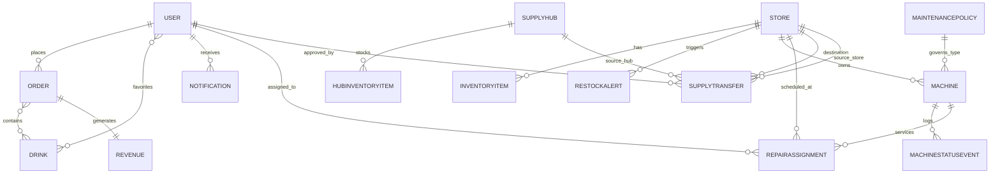

# CodePop – Low-Level Design Document (Sprint 2)
## Section 1 - Introduction

### 1.1 Purpose

This document provides the detailed low-level design of the FloatStack system. It defines the internal architecture, database schema, API structure, and deployment configuration required to implement the system described in the High-Level Design document.

The goal of this document is to describe how each system component is implemented at the code and data level, including interactions between modules and enforcement of system requirements.

### 1.2 Scope

FloatStack is a distributed, multi-store float ordering and management system. The system supports:

- Customer float ordering and pickup  
- Secure user authentication and role-based access control  
- Regional supply hub inventory tracking  
- Machine maintenance and repair scheduling  
- AI-based forecasting and recommendations  
- Distributed synchronization between stores and hubs  
- External integrations (Stripe, FCM, Geolocation APIs)  
- CSV-based data imports  

This document focuses on implementation-level design details including APIs, database schema, state transitions, and system workflows.

### 1.3 Definitions & Acronyms

- **RBAC** – Role-Based Access Control  
- **JWT** – JSON Web Token  
- **FCM** – Firebase Cloud Messaging  
- **CSV** – Comma-Separated Values  
- **Sync Service** – Background service responsible for distributed data updates  
- **Supply Hub** – Regional inventory distribution center  

---

## Section 2 – System Architecture

### Preface

---

## Architectural Decision: Standardize on Django + HTMX (Web-Based Frontend)

### Context

When this codebase was inherited, it included a React Native frontend layered on top of a Django backend. There was limited documentation explaining the rationale behind this architecture.

After evaluating the product goals and current system requirements, the team determined that maintaining both React Native and Django did not align with the actual needs of the application.

FloatStack is primarily a form-driven, CRUD-focused, server-truth-based system supporting:

- Customer ordering
- Inventory management
- Machine maintenance tracking
- Regional supply coordination
- Administrative dashboards

The system does not require complex offline-first behavior, deep mobile-native integrations, or rich client-side state management.

---

### Why React Native Was Removed

#### 1. Misalignment with Product Scope

React Native is well-suited for:

- Rich mobile-native UX
- Offline-first architectures
- Complex client-side state management
- Highly interactive SPA-style interfaces

FloatStack does not meaningfully leverage these capabilities. Instead, it is:

- Form-driven
- Data-entry oriented
- CRUD-focused
- Server-truth-based

The React Native layer functioned largely as a thin client over server APIs without leveraging its full strengths.

---

#### 2. Unnecessary Architectural Complexity

Maintaining both React Native and Django introduced:

- Two development paradigms
- An additional API layer solely for frontend consumption
- Additional build tooling and dependencies
- Larger integration surface area for bugs
- Increased onboarding time for new developers

For a system of this scope, this complexity was unjustified.

---

#### 3. Redundant API Layer

Because the frontend was separated from Django, an internal API layer was required even for basic CRUD flows.

By consolidating around Django:

- Business logic remains centralized
- Request/response flows are simplified
- Duplication is reduced
- Debugging and testing become easier
- The server becomes the single source of truth

This architecture better matches the operational needs of the system.

---

## Addressing Traditional Server-Side UX Concerns

Server-rendered applications are sometimes criticized for:

- Full page refreshes
- Slower interactivity
- Reduced responsiveness compared to SPAs

To mitigate these concerns, FloatStack uses **HTMX**.

---

## Why HTMX

HTMX allows:

- Targeted DOM updates via server-rendered fragments
- Declarative interactivity via HTML attributes
- Minimal custom JavaScript
- Server-side state as the authoritative model

This provides:

- A responsive user experience
- No heavy SPA framework
- Minimal client-side state management
- A significantly simpler architectural model

The server remains authoritative, while the frontend remains lightweight and maintainable.

---

## Architectural Benefits

By standardizing on Django + HTMX:

- System complexity is reduced
- Deployment is simplified (no app store distribution)
- Business logic is centralized
- Debugging and testing are easier
- Maintainability improves long-term
- The architecture matches the problem domain

This reflects a deliberate prioritization of simplicity, clarity, and sustainability.

---

# 2.1 Architectural Pattern

FloatStack is implemented using **Django** as the primary full-stack framework.

### Core Components

- **Frontend:** Django server-rendered templates enhanced with HTMX
- **JSON Endpoints:** Limited to machine-to-machine communication and third-party integrations (e.g., Stripe PaymentIntent creation and inter-store synchronization)
- **Database:** PostgreSQL relational database
- **Background Workers:** Celery with Redis
- **External Services:** Stripe, Firebase Cloud Messaging (FCM), Browser Geolocation API

Django follows the **Model–View–Template (MVT)** pattern:

- **Model** — Database schema and business data (Django ORM models)
- **View** — Request handling logic (Django views or JSON endpoints)
- **Template** — HTML rendering layer

While Django REST Framework (DRF) is available to structure JSON endpoints, the majority of application flows use server-rendered views rather than a broad REST API layer.

This framework choice improves development speed, security, and maintainability.

---

## 2.1.1 Technology Stack

- Backend Framework: Django 5.x
- JSON API Support: Django REST Framework (limited scope)
- Database: PostgreSQL
- Background Processing: Celery + Redis
- Payment Integration: Stripe API (PaymentIntent workflow)
- Notifications: Firebase Cloud Messaging
- Containerization: Docker
- Web Server: Gunicorn + Nginx

---

### 2.2 Project Structure (Django)

The FloatStack system is implemented as a Django project named `codepop_backend`.  
The project follows Django’s standard project–app architecture, separating global configuration from application-specific logic.

The repository is structured as follows:
```
codepop/                           # Repository root
│
├── server/                         # Backend server (Django project root)
│   ├── manage.py
│   ├── requirements.txt
│   │
│   ├── backend/                    # Primary Django application
│   │   ├── management/             # Custom management commands
│   │   ├── migrations/             # Django ORM migration files
│   │   ├── __init__.py
│   │   ├── admin.py                # Django admin configuration
│   │   ├── apps.py                 # App configuration
│   │   ├── customerAI.py           # Customer recommendation logic
│   │   ├── drinkAI.py              # Drink forecasting/recommendation logic
│   │   ├── models.py               # Database models (Django ORM)
│   │   ├── serializers.py          # DRF serializers for API validation
│   │   ├── tests.py                # Unit and integration tests
│   │   ├── urls.py                 # API route definitions (/api/...)
│   │   ├── views.py                # API views (Django REST Framework)
│   │   ├── web_urls.py             # Server-rendered web routes (/)
│   │   └── web_views.py            # Server-rendered web views
│   │
│   ├── config/                     # Django project configuration
│   │   ├── __init__.py
│   │   ├── asgi.py
│   │   ├── settings.py             # Global Django configuration
│   │   ├── urls.py                 # Root URL configuration
│   │   └── wsgi.py
│   │
│   ├── static/                     # Static assets
│   │   ├── css/
│   │   ├── js/
│   │   └── images/
│   │
│   ├── templates/                  # Django HTML templates
│   │   ├── base.html               # Base template
│   │   ├── orders/                 # Order templates
│   │   ├── inventory/              # Inventory templates
│   │   └── ...
│   │
│   ├── db/                         # Database files
│   │   └── db.sqlite3              # (development only)
│   │
│   └── clean_database.sh           # Database utility scripts
│
├── docs/                           # Documentation (LLD, HLD, requirements)
│   ├── LowLevelDesign.md
│   ├── HighLevelDesign.md
│   ├── RequirementsDoc.md
│   └── diagrams/
│
├── .git/                           # Git repository
├── .gitignore
└── README.md
```


### Structure Overview

- **`server/`** — Django backend server
- **`backend/`** — Core domain logic (orders, inventory, machines, AI modules)
- **`config/`** — Global Django configuration
- **`static/`, `templates/`** — Presentation layer
- **`docs/`** — Design documentation

This structure clearly separates configuration, domain logic, and presentation assets.

---

# 2.3 Design Patterns Used

The system implements the following design patterns:

- Model–View–Template (MVT)
- Service Layer Pattern
- Repository Pattern
- Middleware Pattern (RBAC enforcement)
- Event-Driven Design (notifications, async jobs)
- State Machine Pattern (order and machine lifecycle states)

---

# 2.4 API Design Conventions

Although FloatStack is primarily server-rendered, JSON APIs are exposed where necessary.

## URL Namespace Structure

| Namespace | Purpose | Type | Example |
|------------|---------|------|----------|
| `/api/` | JSON-only: Stripe payment intent + inter-store sync | JSON API | `POST /api/create-payment-intent/` |
| `/` | Customer-facing web pages | HTML | `GET /` |
| `/manager/` | Store manager dashboard | HTML | `GET /manager/orders/` |
| `/logistics/` | Logistics manager dashboard | HTML | `GET /logistics/inventory/` |
| `/admin/` | Django admin interface | HTML | `GET /admin/` |

### Design Principle

`/api/` endpoints are reserved strictly for:

- Third-party integrations (e.g., Stripe)
- Machine-to-machine inter-store communication

All customer-facing and staff-facing interactions use server-rendered Django templates enhanced with HTMX.

---

## HTTP Status Codes

- 200 – Success
- 201 – Created
- 400 – Bad Request
- 401 – Unauthorized
- 403 – Forbidden
- 404 – Not Found
- 500 – Internal Server Error

---

## Standard Error Format (JSON Endpoints Only)

```json
{
  "error": "Error message",
  "code": 400
}
```

#### Authentication Header

```
Authorization: Bearer <JWT_TOKEN>
```

### 2.5 Deployment Design

The system is containerized using Docker.

Deployment components include:

- Django application container
- PostgreSQL database container
- Celery worker container (for background tasks)
- Redis container (message broker for Celery)

The application runs using:

- Gunicorn (WSGI server)
- Nginx (reverse proxy)

Environment variables are used for:

- Database connection settings
- Django SECRET_KEY
- Stripe API keys
- FCM credentials
- Debug/production mode

The system supports:

- Local development (Django development server)
- Production deployment using Docker Compose

### 2.6 Django Admin Interface

Django’s built-in admin interface is used for:

- Managing users
- Managing stores and supply hubs
- Viewing inventory levels
- Monitoring machine status

This allows administrators to manage system data without direct database access.

### 2.7 Architecture Diagram

An architecture diagram will be included to illustrate:

- Django application
- PostgreSQL database
- Celery workers
- Redis broker
- External service integrations

---

## Section 3 - User Management & Security
### 3.1 Architectural Overview

The CodePop platform implements a secure, role-based user management system using Django’s built-in authentication framework extended with custom authorization logic. The design follows the Principle of Least Privilege and ensures that users only have access to data and operations required for their specific role.

Supported roles include:

- super_admin
- admin
- manager
- logistics_manager
- repair_staff
- account_user
- general_user

Authentication is handled using JSON Web Tokens (JWT), and authorization is enforced at three levels:

1. API/View-level permission enforcement  
2. Service-layer business rule enforcement  
3. Database query filtering  

This layered security approach prevents privilege escalation and protects store and regional boundaries.

---

### 3.2 User Model Design

The system extends Django’s `AbstractUser` model to incorporate additional constraints and domain-specific attributes.

```python
class User(AbstractUser):
    id = models.UUIDField(primary_key=True, default=uuid4, editable=False)
    email = models.EmailField(unique=True)
    role = models.CharField(max_length=30, choices=UserRole.choices)
    store = models.ForeignKey(Store, null=True, on_delete=models.SET_NULL)
    region = models.ForeignKey(Region, null=True, on_delete=models.SET_NULL)
    is_active = models.BooleanField(default=True)
    failed_login_attempts = models.IntegerField(default=0)
    last_login_ip = models.GenericIPAddressField(null=True)
    created_at = models.DateTimeField(auto_now_add=True)
    updated_at = models.DateTimeField(auto_now=True)
```

#### Design Decisions and Justification

**UUID Primary Keys**
- Prevent predictable ID enumeration attacks.
- Improve security across distributed store nodes.

**Role Enumeration**
- Enforced via Django model `choices`.
- Prevents arbitrary string-based role injection.

**Store and Region Foreign Keys**
- Restrict data access scope.
- Enforce multi-store isolation.
- Prevent cross-store data leakage.

**Soft Deletion**
- Accounts are deactivated rather than deleted.
- Preserves historical order and audit data.

---

### 3.3 Role-Based Access Control (RBAC)

RBAC is implemented using:

- Django permission classes
- Middleware validation
- Queryset filtering
- Service-layer validation logic

Example permission enforcement:

```python
class IsManagerOfStore(BasePermission):
    def has_permission(self, request, view):
        return (
            request.user.role == "manager" and
            request.user.store == view.get_store()
        )
```

#### Enforcement Strategy

| Role | Access Scope | Restrictions |
|------|--------------|--------------|
| super_admin | All regions | Logged + monitored |
| admin | Assigned store | No cross-store access |
| manager | Assigned store | No user role editing |
| logistics_manager | Assigned region | No financial data |
| repair_staff | Assigned store | No user/payment access |
| account_user | Personal data only | Cannot access system data |
| general_user | Limited ordering | No account storage |

---

### 3.4 Authentication Strategy

Authentication uses:

- Django REST Framework
- SimpleJWT
- Secure HTTP-only cookies
- HTTPS-only transmission

#### Token Lifecycle

- Access Token: 15 minutes
- Refresh Token: 7 days
- Rotation enabled
- Blacklist on logout
- Token binding to device (optional enhancement)

#### Brute Force Protection

- Rate limiting using Django throttling
- Account lockout after 5 failed login attempts
- CAPTCHA after threshold breaches
- IP logging for anomaly detection

---

### 3.5 Password and Credential Security

- Hashed using PBKDF2 + SHA256 (Django default)
- Minimum 12 characters
- Uppercase, lowercase, numeric, and special character enforcement
- Password history enforcement (cannot reuse last 5)
- Secure reset tokens with expiration

Passwords are never logged or stored in plain text.

---

### 3.6 Stripe Payment Security

Stripe is used for secure payment processing.

### Design Approach

- Stripe handles all card data directly.
- No card numbers stored in CodePop database.
- Backend creates PaymentIntent.
- Frontend confirms payment via Stripe SDK.
- Webhooks validate payment result.

Webhook verification:

```python
event = stripe.Webhook.construct_event(
    payload,
    sig_header,
    endpoint_secret
)
```

### Additional Protections

- Idempotency keys for duplicate prevention
- Asynchronous webhook processing
- Signature verification
- Payment status validation before order fulfillment

---

## Section 4 - Order & Payment System Design
*Owner: Matthew*

---

## Section 4: Order & Payment System Design

### 4.1 Overview

The Order & Payment System is responsible for the complete lifecycle of a customer order — from cart management through payment processing, order creation, drink preparation timing, pickup coordination, and refund handling. It integrates with Stripe for payment processing, Firebase Cloud Messaging (FCM) for push notifications, and device geolocation services for proximity-based drink preparation.

The system supports both **account users** (authenticated, with saved preferences and payment history) and **general users** (guest checkout, no persisted data).

---

### 4.2 Order Lifecycle State Machine

An order progresses through the following states:
```
[Cart] → [Payment Initiated] → [Payment Confirmed] → [Pending Pickup Trigger]
    → [Processing/Preparing] → [Completed/Ready] → [Picked Up]
                                                   → [Expired (30 min)]
[Any pre-preparation state] → [Cancelled] → [Refunded]
```

**Order Status Values** (stored in `Order.OrderStatus`):
| Status | Description |
|---|---|
| `pending` | Order created, awaiting payment confirmation or preparation trigger |
| `processing` | Drink is being prepared (triggered by geolocation proximity, "I'm Here" button, or scheduled time) |
| `completed` | Drink is ready for pickup in the cooler |
| `cancelled` | Order cancelled by user before preparation began |

**Payment Status Values** (stored in `Order.PaymentStatus`):
| Status | Description |
|---|---|
| `pending` | Payment not yet processed |
| `paid` | Stripe payment confirmed |
| `failed` | Stripe payment failed |
| `remade` | Drink was remade (edge case) |

---

### 4.3 Data Models

#### 4.3.1 Order Model
```python
class Order(models.Model):
    ORDER_STATUS_CHOICES = [
        ('pending', 'Pending'),
        ('processing', 'Processing'),
        ('completed', 'Completed'),
        ('cancelled', 'Cancelled'),
    ]

    PAYMENT_STATUS_CHOICES = [
        ('pending', 'Pending'),
        ('paid', 'Paid'),
        ('failed', 'Failed'),
        ('remade', 'Remade'),
    ]

    OrderID      = models.AutoField(primary_key=True)
    UserID       = models.ForeignKey(User, on_delete=models.CASCADE, null=True)
    Drinks       = models.ManyToManyField(Drink)
    OrderStatus  = models.CharField(max_length=50, choices=ORDER_STATUS_CHOICES, default='pending')
    PaymentStatus = models.CharField(max_length=50, choices=PAYMENT_STATUS_CHOICES, default='pending')
    PickupTime   = models.DateTimeField(null=True, blank=True)
    CreationTime = models.DateTimeField(auto_now_add=True)
    LockerCombo  = models.BigIntegerField(null=True)
    StripeID     = models.CharField()
```

**Field Details:**
- `UserID`: References Django's built-in `User` model. Nullable for general (guest) users.
- `Drinks`: Many-to-many relationship with the `Drink` model. An order can contain multiple drinks; a drink (e.g., a seasonal preset) can appear in multiple orders.
- `LockerCombo`: A randomly generated 5-digit code assigned post-payment, used by the customer to open the pickup cooler.
- `StripeID`: Stores the Stripe `PaymentIntent` client secret, used for refund processing.

**Methods:**
- `add_drinks(drink_ids)`: Accepts a list of `DrinkID` values, resolves each to a `Drink` object, and adds them to the `Drinks` M2M relationship.
- `remove_drinks(drink_ids)`: Removes specified drinks from the order's M2M relationship.

#### 4.3.2 Revenue Model
```python
class Revenue(models.Model):
    RevenueID   = models.AutoField(primary_key=True)
    OrderID     = models.IntegerField(default=1)
    TotalAmount = models.FloatField(default=0.0)
    SaleDate    = models.DateTimeField(default=timezone.now)
    Refunded    = models.BooleanField(default=False)
```

**Purpose:** Tracks financial data for each completed order. The `calculate_total_amount()` method sums the `Price` of all drinks linked to the associated `OrderID`.

#### 4.3.3 Drink Model (Order-Relevant Fields)
```python
class Drink(models.Model):
    DrinkID     = models.AutoField(primary_key=True)
    Name        = models.CharField(max_length=255)
    SyrupsUsed  = ArrayField(models.CharField(max_length=255), blank=True, null=True)
    SodaUsed    = ArrayField(models.CharField(max_length=255))
    AddIns      = ArrayField(models.CharField(max_length=255), blank=True, null=True)
    Price       = models.FloatField()
    Size        = models.CharField(default="m")
    Ice         = models.CharField(default="normal")
    User_Created = models.BooleanField()
    Favorite    = models.ManyToManyField('auth.User', blank=True)
```

**Pricing Logic (Server-Side):**
- Base price: $2.00
- Per additional ingredient (syrup or add-in): +$0.30
- Seasonal/preset drinks use their stored `Price` value directly.
- Price is calculated server-side in the `calculate_price` view to prevent client-side tampering.

---

### 4.4 API Endpoints

#### 4.4.1 Order CRUD Endpoints

| Method | Endpoint | Description | Auth |
|--------|----------|-------------|------|
| `GET` | `/api/orders/` | List all orders | Public |
| `POST` | `/api/orders/` | Create a new order | Public |
| `GET` | `/api/orders/<id>/` | Retrieve a specific order | Public |
| `PUT` | `/api/orders/<id>/` | Update an order | Public |
| `PATCH` | `/api/orders/<id>/` | Partial update (status, locker combo, add/remove drinks) | Public |
| `DELETE` | `/api/orders/<id>/` | Delete an order | Public |
| `GET` | `/api/users/<user_id>/orders/` | List all orders for a specific user | Authenticated |
| `POST` | `/api/users/<user_id>/orders/` | Create an order for a specific user | Authenticated |

#### 4.4.2 Order Creation Request Body
```json
{
  "UserID": 5,
  "Drinks": [12, 14, 15],
  "OrderStatus": "processing",
  "PaymentStatus": "paid",
  "StripeID": "pi_3abc123_secret_xyz"
}
```

**Validation:**
- `Drinks` array must contain at least one drink ID (enforced by `OrderSerializer.validate_Drinks()`).
- `StripeID` stores the Stripe PaymentIntent client secret for future refund operations.

#### 4.4.3 Payment Endpoint

| Method | Endpoint | Description |
|--------|----------|-------------|
| `POST` | `/api/create-payment-intent/` | Create a Stripe PaymentIntent |

**Request Body:**
```json
{
  "amount": 5.60
}
```

**Response:**
```json
{
  "paymentIntent": "pi_3abc123_secret_xyz",
  "publishableKey": "pk_test_..."
}
```

#### 4.4.4 Revenue Endpoints

| Method | Endpoint | Description |
|--------|----------|-------------|
| `GET` | `/api/revenues/` | List all revenue records |
| `POST` | `/api/revenues/` | Create a revenue entry |
| `GET` | `/api/revenues/<id>/` | Retrieve a revenue record |
| `PUT` | `/api/revenues/<id>/` | Update a revenue record |
| `DELETE` | `/api/revenues/<id>/` | Delete a revenue record |

#### 4.4.5 Email Confirmation Endpoint

| Method | Endpoint | Description |
|--------|----------|-------------|
| `GET` | `/api/email/<orderId>/` | Generate and log an email receipt preview |

---

### 4.5 Frontend Order Flow

#### 4.5.1 Cart Management

**State (server-rendered Django template):**
- Cart contents are maintained in the user's server-side session.
- `total_price`: Calculated server-side by the `calculate_price` view function, summing all drink prices in the cart.

**Cart Operations:**
1. **View Cart**: The cart page renders drink objects from the session, with prices calculated server-side.
2. **Remove Drink**: Sends a DELETE request via HTMX to `/api/drinks/<id>/` (only for user-created drinks); the server updates the session and returns a partial template re-rendering the cart.
3. **Edit Drink**: Navigates to the drink update page, passing the drink ID.
4. **Price Calculation**: Server-side `calculate_price(drink)` — if `drink.Price == 2` (user-created), computes $2.00 + ($0.30 × ingredient count). Otherwise, uses the stored `Price`.

#### 4.5.2 Checkout Flow

The checkout page uses Stripe.js loaded from CDN to handle payment collection.

**Initialization:**
1. On page load, the Django view calls `POST /api/create-payment-intent/` internally and passes the `paymentIntent` client secret to the template context.
2. The template initializes the Stripe Payment Element using the client secret.
```html


  const stripe = Stripe('pk_test_...');
  const elements = stripe.elements({ clientSecret: '{{ payment_intent_secret }}' });
  const paymentElement = elements.create('payment');
  paymentElement.mount('#payment-element');

```

**Payment Execution:**
1. On form submit, `stripe.confirmPayment()` handles card submission via Stripe's Payment Element.
2. On success:
   - An HTMX POST creates an order at `/api/orders/` with drink IDs, `PaymentStatus: 'paid'`, and the Stripe client secret.
   - A revenue record is created at `POST /api/revenues/` with the `OrderID` and `TotalAmount`.
   - `GET /api/email/<orderNum>/` generates an email receipt.
   - The page redirects to the post-checkout screen.
3. On failure: An error message is rendered inline via HTMX without a full page refresh.

#### 4.5.3 Post-Checkout & Preparation Timing

**Preparation Triggers (one of three methods):**
1. **Geolocation Proximity**: Uses the Browser Geolocation API (`navigator.geolocation.getCurrentPosition()`) to track user position. When the user is within 457.2 meters (500 yards) of the store coordinates, `isNearby` is set to `true` and the preparation countdown begins.
2. **"I've Arrived" / Manual Button**: If location permissions are denied, the user can manually trigger preparation via an HTMX-wired button.
3. **"Location Not Working" Fallback**: Alternative manual trigger displayed when geolocation is active but the user hasn't arrived.

**Countdown Timer:**
- Starts at 60 seconds when preparation is triggered.
- Displays as `MM:SS` format.
- When timer reaches 0, sends `PATCH /backend/orders/<id>/` with `OrderStatus: 'completed'`.

**Locker Combo:**
- Generated server-side as a random 5-digit numeric string.
- Stored on the order via `PATCH /backend/orders/<id>/` with `LockerCombo: <combo>`.

**Inventory Deduction:**
- After checkout, the system fetches the full inventory report via `GET /api/inventory/report/`.
- Matches each ingredient used in purchased drinks against inventory item names.
- Sends `PATCH /api/inventory/<id>/` with `used_quantity: 1` for each matched item.

---

### 4.6 Refund Processing

**Refund Function (Backend):**
```python
def refund_order(client_secret_or_id):
    # Extract PaymentIntent ID from client secret if needed
    if "_secret_" in client_secret_or_id:
        payment_intent_id = client_secret_or_id.split("_secret_")[0]
    else:
        payment_intent_id = client_secret_or_id

    refund = stripe.Refund.create(payment_intent=payment_intent_id)
    return True  # or False on error
```

**Refund Policy:**
- Full refund available if the order is cancelled **before** drink preparation begins (i.e., `OrderStatus` is still `pending`).
- Refund must be processed within 24 hours of the original payment.
- The `Revenue.Refunded` field is set to `True` on the corresponding revenue record.
- The Stripe `PaymentIntent` ID (extracted from the stored `StripeID` client secret) is used to issue the refund via Stripe's Refund API.

---

### 4.7 Order Expiration

- Drinks placed in the pickup cooler must be picked up within **30 minutes**.
- After 30 minutes, the order is considered expired and the drink is discarded.
- This is enforced by the cooler management system (manager dashboard monitors cooler status and wait times).

---

### 4.8 Sequence Diagram — Complete Order Flow
```
Customer              Web Browser (Django/HTMX)         Backend (Django)            Stripe API
   |                         |                              |                        |
   |--- Add drinks to cart --|                              |                        |
   |                         |-- Session stores cart items  |                        |
   |--- Tap "Pay Now" ------|                              |                        |
   |                         |-- Django view calls POST /api/create-payment-intent/ |
   |                         |                              |-- Create PaymentIntent ->|
   |                         |                              |<-- client_secret --------|
   |                         |-- Render checkout page with Stripe Payment Element    |
   |--- Enter card details --|                              |                        |
   |--- Submit payment ------|-- stripe.confirmPayment() ---|----------------------->|
   |                         |<---- Payment Result (success/fail) ------------------|
   |                         |                              |                        |
   |                    [On Success]                        |                        |
   |                         |-- POST /api/orders/ (drinks, StripeID, paid) --->|
   |                         |<---- OrderID ------------------------------------------------|
   |                         |-- POST /api/revenues/ (OrderID, TotalAmount) ---->|
   |                         |-- GET /api/email/<orderId>/ ---->|               |
   |                         |-- Redirect to post-checkout page     |               |
   |                         |                              |                        |
   |--- Approach store ------|                              |                        |
   |                         |-- Browser Geolocation API checks distance            |
   |                         |   (< 457.2m = nearby)       |                        |
   |                         |-- Start 60s countdown        |                        |
   |                         |-- PATCH /api/orders/<id>/ LockerCombo ----------->|
   |                         |                              |                        |
   |--- Timer reaches 0 ----|                              |                        |
   |                         |-- PATCH /api/orders/<id>/ OrderStatus=completed ->|
   |                         |-- PATCH /api/inventory/<id>/ used_quantity ------>|
   |                         |                              |                        |
   |--- Enter locker code ---|                              |                        |
   |--- Pick up drink -------|                              |                        |
```

---

---

## Section 5 — Supply Hub & Inventory Management

### 5.1 Overview

The Supply Hub & Inventory Management module translates the HLD's "Supply Hub & Inventory Module (EXPANDED)" into concrete implementation specifications. Its core responsibilities are:

- Tracking ingredient and physical item stock at each store location in real time
- Managing 7 regional supply hubs (Regions A–G), each capable of supplying stores within their own region as well as stores in other regions within 1000 miles
- Optimizing delivery routing between hubs and stores, and between stores directly
- Providing AI-assisted low-stock alerts and reorder quantity recommendations based on historical usage
- Supporting store-to-store supply transfers for nearby locations

One `logistics_manager` is assigned per region and is responsible for all supply coordination within that region. Inventory deductions occur automatically as orders are fulfilled, with threshold-based alerts triggering AI-generated restock recommendations when stock falls to or below a defined level.

---

### 5.2 Module Components

The following table maps each HLD component to its Django app, implementing class or service, and primary responsibility.

| Component | Django App | Class | Responsibility |
| :--- | :--- | :--- | :--- |
| Inventory Service | `inventory` | `InventoryService` | CRUD for store-level inventory items; deduct quantities on order completion |
| Supply Hub Service | `supply_hubs` | `SupplyHubService` | Manage 7 regional hubs; enforce 1000-mile cross-region delivery rule |
| Supply Routing Service | `supply_hubs` | `RoutingService` | Optimize delivery routes hub→store and store→store |
| Reorder Service | `inventory` | `ReorderService` | AI-assisted low-stock alerts and reorder quantity predictions |
| Transfer Service | `supply_hubs` | `TransferService` | Store-to-store supply transfer requests and approvals |
| Menu/Ingredient Service | `inventory` | `IngredientService` | Track which ingredients are active and available for ordering |

---

### 5.3 Data Models

The following tables define the database schema for all models in this module. Field names use Django ORM conventions, and table names reflect Django's default `<app>_<model>` naming pattern.

#### InventoryItem (`inventory_inventoryitem`)

Tracks the current stock of a single item at a specific store location.

| Field | Django Field Type | Constraints |
| :--- | :--- | :--- |
| `id` | `AutoField` | Primary Key |
| `store` | `ForeignKey(Store, on_delete=CASCADE)` | Not Null |
| `item_name` | `CharField(max_length=150)` | Not Null |
| `item_type` | `CharField(max_length=20)` | Choices: `soda`, `syrup`, `add_in`, `physical` |
| `quantity` | `DecimalField(max_digits=10, decimal_places=3)` | Not Null, ≥ 0 |
| `unit` | `CharField(max_length=30)` | Not Null (e.g., `bottles`, `oz`, `units`) |
| `threshold_level` | `DecimalField(max_digits=10, decimal_places=3)` | Not Null; triggers alert when `quantity <= threshold_level` |
| `last_updated` | `DateTimeField(auto_now=True)` | Auto-set on every save |

---

#### SupplyHub (`supply_hubs_supplyhub`)

Represents one of the 7 regional supply hubs. Each hub is assigned to a fixed region and serves as the primary restocking source for stores within that region.

| Field | Django Field Type | Constraints |
| :--- | :--- | :--- |
| `id` | `AutoField` | Primary Key |
| `name` | `CharField(max_length=100)` | Not Null |
| `region` | `CharField(max_length=1)` | Choices: `A`, `B`, `C`, `D`, `E`, `F`, `G` |
| `address` | `TextField` | Not Null |
| `latitude` | `DecimalField(max_digits=9, decimal_places=6)` | Not Null |
| `longitude` | `DecimalField(max_digits=9, decimal_places=6)` | Not Null |
| `is_active` | `BooleanField` | Default `True` |

---

#### HubInventoryItem (`supply_hubs_hubinventoryitem`)

Tracks the current stock held at a supply hub, mirroring the store-level `InventoryItem` structure.

| Field | Django Field Type | Constraints |
| :--- | :--- | :--- |
| `id` | `AutoField` | Primary Key |
| `hub` | `ForeignKey(SupplyHub, on_delete=CASCADE)` | Not Null |
| `item_name` | `CharField(max_length=150)` | Not Null |
| `item_type` | `CharField(max_length=20)` | Choices: `soda`, `syrup`, `add_in`, `physical` |
| `quantity` | `DecimalField(max_digits=10, decimal_places=3)` | Not Null, ≥ 0 |
| `unit` | `CharField(max_length=30)` | Not Null |
| `last_updated` | `DateTimeField(auto_now=True)` | Auto-set on every save |

---

#### SupplyTransfer (`supply_hubs_supplytransfer`)

Records a supply movement request from an internal source (store or hub) to a destination store. Transfers are initiated by a `manager` or `logistics_manager` and tracked through their full lifecycle.

| Field | Django Field Type | Constraints |
| :--- | :--- | :--- |
| `id` | `AutoField` | Primary Key |
| `source_type` | `CharField(max_length=20)` | Choices: `store`, `hub` |
| `source_store` | `ForeignKey(Store, on_delete=SET_NULL, null=True, blank=True)` | Nullable; populated when `source_type = store` |
| `source_hub` | `ForeignKey(SupplyHub, on_delete=SET_NULL, null=True, blank=True)` | Nullable; populated when `source_type = hub` |
| `destination_store` | `ForeignKey(Store, on_delete=CASCADE)` | Not Null |
| `item_name` | `CharField(max_length=150)` | Not Null |
| `quantity` | `DecimalField(max_digits=10, decimal_places=3)` | Not Null, > 0 |
| `status` | `CharField(max_length=20)` | Choices: `pending`, `approved`, `in_transit`, `delivered` |
| `requested_at` | `DateTimeField(auto_now_add=True)` | Auto-set on creation |
| `delivered_at` | `DateTimeField(null=True, blank=True)` | Set when status transitions to `delivered` |
| `logistics_manager` | `ForeignKey(User, on_delete=SET_NULL, null=True)` | The `logistics_manager` who approved or initiated the transfer |

---

#### RestockAlert (`inventory_restockalert`)

Generated automatically when an `InventoryItem`'s quantity falls to or below its `threshold_level`. The AI component populates `recommended_order_quantity` and `ai_justification` based on the store's rolling 30-day usage history.

| Field | Django Field Type | Constraints |
| :--- | :--- | :--- |
| `id` | `AutoField` | Primary Key |
| `store` | `ForeignKey(Store, on_delete=CASCADE)` | Not Null |
| `item_name` | `CharField(max_length=150)` | Not Null |
| `current_quantity` | `DecimalField(max_digits=10, decimal_places=3)` | Not Null; snapshot at time of alert creation |
| `threshold_level` | `DecimalField(max_digits=10, decimal_places=3)` | Not Null; copied from `InventoryItem` at alert time |
| `recommended_order_quantity` | `DecimalField(max_digits=10, decimal_places=3)` | Null until AI analysis completes |
| `ai_justification` | `TextField` | AI-generated explanation for the recommended quantity |
| `status` | `CharField(max_length=20)` | Choices: `open`, `acknowledged`, `ordered` |
| `created_at` | `DateTimeField(auto_now_add=True)` | Auto-set on creation |

---

### 5.4 Key Business Logic

#### Inventory Deduction on Order Completion

When an order is marked as complete, the `InventoryService` deducts each ingredient used from the store's `InventoryItem` records. This operation runs inside a database transaction to prevent race conditions under concurrent order processing. If any item's quantity drops to or below its threshold after deduction, a `RestockAlert` is triggered.

```python
with transaction.atomic():
    for ingredient, amount in order.ingredients_used.items():
        item = InventoryItem.objects.select_for_update().get(
            store=order.store, item_name=ingredient
        )
        item.quantity -= amount
        item.save()
        if item.quantity <= item.threshold_level:
            ReorderService.trigger_alert(item)
```

#### Supply Hub Resolution (1000-Mile Rule)

When a store needs to restock an item, the `RoutingService` resolves the best supply source by checking candidates in the following priority order:

1. **Store's own inventory** — if already above threshold, no transfer needed
2. **Nearby stores within the region** — checked for surplus above their own threshold
3. **Supply hubs in the destination store's region** — primary restocking source for in-region needs
4. **Cross-region hub relay (1000-mile rule)** — if no in-region hub has stock, transfer from an eligible out-of-region hub to a destination-region hub first, then complete hub→store delivery

For each candidate, the routing logic returns an estimated delivery time and cost. The result is a prioritized list that the `logistics_manager` can review and act on, or that the system can use to auto-generate a `SupplyTransfer` request.

![Supply Hub Resolution Flow]


#### Store-to-Store Transfers

A `logistics_manager` or `manager` can create a store-to-store transfer by submitting the transfer form on the dashboard. Before approving, the `TransferService` validates that the source store has a quantity sufficient to cover both the requested transfer amount and its own operational threshold:

```python
if source_item.quantity - transfer.quantity < source_item.threshold_level:
    raise ValidationError("Source store does not have sufficient surplus to fulfill this transfer.")
```

Approved transfers are tracked in `SupplyTransfer` and status-updated through `in_transit` to `delivered` as the shipment progresses.

#### AI Restock Recommendations

The `ReorderService` generates reorder quantity recommendations when a `RestockAlert` is created. It reads the store's `SupplyUsageRecord` (see Section 8.4.5) for the past 30 days, computes a rolling daily average for the affected item, and recommends an order quantity sufficient to cover the next 30 days of projected usage. The recommendation and a plain-language justification are stored on the `RestockAlert` record:

```python
avg_daily_usage = SupplyUsageRecord.objects.filter(
    store=alert.store,
    item_name=alert.item_name,
    date__gte=thirty_days_ago
).aggregate(avg=Avg('quantity_used'))['avg'] or 0

recommended_qty = round(avg_daily_usage * 30, 3)
alert.recommended_order_quantity = recommended_qty
alert.ai_justification = (
    f"Based on a 30-day average daily usage of {avg_daily_usage:.3f} {item.unit}, "
    f"an order of {recommended_qty} {item.unit} is recommended to cover the next 30 days."
)
alert.save()
```

---

### 5.5 Views and Endpoints

All views require Django session authentication (login required). Role access is enforced at the view level using Django `LoginRequiredMixin` and custom role-checking mixins. Views are server-rendered Django templates; HTMX attributes on the templates handle partial-page updates without full reloads.

| Method | Path | Required Role | Description |
| :--- | :--- | :--- | :--- |
| GET | `/api/inventory/` | `manager`, `admin` | List all inventory items for the requester's store |
| PATCH | `/api/inventory/{id}/` | `manager` | Manually update an item's quantity (e.g., after a physical count) |
| GET | `/api/supply-hubs/` | `logistics_manager`, `super_admin` | List all 7 supply hubs |
| GET | `/api/supply-hubs/{id}/inventory/` | `logistics_manager` | List current stock levels at a specific hub |
| POST | `/api/supply-transfers/` | `logistics_manager`, `manager` | Create a new supply transfer request |
| PATCH | `/api/supply-transfers/{id}/` | `logistics_manager` | Update transfer status (approve, mark in-transit, mark delivered) |
| GET | `/api/restock-alerts/` | `manager`, `logistics_manager` | View open restock alerts for managed stores |
| PATCH | `/api/restock-alerts/{id}/` | `manager` | Acknowledge an alert or mark it as ordered |

---

### 5.6 Logistics Manager Dashboard

The logistics manager dashboard is a server-rendered Django template view that aggregates data from this module to give a regional supply overview. Each panel below is rendered as a Django template fragment and updated via HTMX (`hx-get`, `hx-trigger`, `hx-swap`) so the dashboard supports partial refresh without full page reloads.

The following panels and display elements are required:

- **Regional Inventory Grid** — a table showing all stores in the manager's region with each item's current quantity and threshold level. Items within 20% of their threshold are highlighted yellow; items at or below threshold are highlighted red. Uses `hx-get` with a poll interval to auto-refresh.
- **Hub Stock Levels** — current `HubInventoryItem` quantities for the manager's regional hub, with the same color-coded threshold indicators.
- **Open Restock Alerts** — a list of all `RestockAlert` records with status `open` or `acknowledged` for stores in the region, including the AI-recommended order quantity and `ai_justification` text. The "Acknowledge" and "Mark Ordered" actions use `hx-patch` to update the alert inline without page reload.
- **Active Supply Transfers** — all `SupplyTransfer` records with status `pending`, `approved`, or `in_transit` for stores in the region, showing source, destination, item, quantity, and estimated delivery. Status updates (approve, mark in-transit, mark delivered) use `hx-patch` to swap the updated row.
- **Historical Supply Transfers** — completed (`delivered`) transfers filterable by store, item, and date range. Filters submit via `hx-get` and swap the table body.
- **AI Delivery Schedule Suggestions** — AI-generated recommendations for upcoming delivery runs, derived from open restock alerts and hub stock levels, sorted by urgency.

---

### 5.7 Granular Implementation Plan (What To Build, In Order)

The sequence below defines implementation order, concrete developer tasks, and expected outputs so this section can be implemented without ambiguity.

#### Phase 1: Data Layer and Migrations

1. Create Django apps if not already present:
   - `inventory`
   - `supply_hubs`
2. Implement models from Section 5.3:
   - `InventoryItem`
   - `SupplyHub`
   - `HubInventoryItem`
   - `SupplyTransfer`
   - `RestockAlert`
3. Add constraints at the model and database level:
   - Non-negative checks for quantity fields
   - `status` and `item_type` choice constraints
   - Foreign key nullability as defined in Section 5.3
4. Create and apply migrations.
5. Seed initial data:
   - 7 `SupplyHub` rows (regions A-G)
   - Baseline hub inventory rows for key ingredients and physical items

**Output of Phase 1:** Database schema exists exactly as documented, migrations apply cleanly, and seed data creates all 7 hubs.

#### Phase 2: Core Services

1. Build `InventoryService` methods:
   - `deduct_for_completed_order(order_id)`
   - `manual_adjustment(inventory_item_id, new_qty, actor_user_id)`
2. Build `ReorderService` methods:
   - `trigger_alert(inventory_item_id)`
   - `compute_recommendation(alert_id)` using rolling 30-day average
3. Build `RoutingService` methods:
   - `resolve_supply_source(store_id, item_name, qty_needed)`
   - Enforce 1000-mile cross-region hub rule
4. Build `TransferService` methods:
   - `create_transfer(request_payload, actor_user_id)`
   - `update_transfer_status(transfer_id, new_status, actor_user_id)`
5. Enforce transactional safety:
   - Inventory deduction and transfer completion must run inside `transaction.atomic()`
   - Use `select_for_update()` on inventory rows touched by deduction/transfer logic

**Output of Phase 2:** Service layer performs all required business logic, including locking and alert creation.

#### Phase 3: Views, Templates, and Permissions

1. Implement Django views (class-based, using `LoginRequiredMixin` and custom role mixins) for all endpoints in Section 5.5.
2. Create Django templates for each view, using HTMX attributes for partial-page updates (e.g., `hx-get`, `hx-patch`, `hx-swap`).
3. Implement Django forms for data input (inventory adjustment, transfer creation).
4. Enforce role checks:
   - Managers limited to their own store(s)
   - Logistics managers limited to region scope
   - `super_admin` can view all hubs and transfers
5. Add standardized error responses:
   - 400 validation failures
   - 403 authorization failures
   - 404 resource scoping failures (resource exists but is outside allowed scope should return 403 or 404 per team policy)
6. Add pagination for list views likely to grow (`restock-alerts`, `supply-transfers`).

**Output of Phase 3:** All Section 5.5 views are reachable, role-protected, and render correct Django templates with HTMX interactivity.

#### Phase 4: Dashboard Template and HTMX Panels

1. Create the logistics manager dashboard template with panel layout for:
   - Regional inventory grid
   - Hub stock
   - Open alerts
   - Active transfers
   - Historical transfers
2. Add threshold highlighting via CSS classes applied in the template:
   - `.status-normal`, `.status-warning`, `.status-critical`
3. Implement HTMX partial endpoints (each returns an HTML fragment) for:
   - Panel refresh (auto-poll or on-demand)
   - Inline status updates (alert acknowledge, transfer approve)
   - Filter submission (date range, store, item name/type)
4. Add Django template caching where appropriate (short TTL) for high-read panels.

**Output of Phase 4:** Dashboard renders all required panels server-side with HTMX-driven partial updates, no client-side business logic needed.

#### Phase 5: Testing, Monitoring, and Hardening

1. Unit tests for each service path.
2. Integration tests for full transfer lifecycle and order-complete deduction flow.
3. Permission tests for every endpoint role combination.
4. Add logging and metrics:
   - Alert generation count
   - Transfer lead time
   - Failed transfer attempts due to insufficient surplus
5. Add failure handling:
   - Graceful message when AI recommendation generation fails (alert remains open with null recommendation)

**Output of Phase 5:** Test suite validates behavior, permission boundaries are enforced, and failures are observable.

---

### 5.8 Definition of Done (Section 5)

Section 5 is complete only when all items below are true:

1. All models from Section 5.3 are implemented with migrations applied in a clean database.
2. Each endpoint in Section 5.5 exists and returns documented behavior for both success and failure cases.
3. Inventory is deducted automatically on order completion and low-stock alerts are generated at threshold crossings.
4. Routing logic demonstrates correct candidate priority, including cross-region relay limited to 1000 miles.
5. Transfer workflow supports `pending -> approved -> in_transit -> delivered` with correct role restrictions.
6. AI restock recommendation values are persisted to `RestockAlert` and include human-readable justification text.
7. Logistics dashboard requirements from Section 5.6 are all rendered via Django templates with HTMX partial updates.
8. Automated tests pass:
   - Unit tests for services
   - API tests for endpoints and permissions
   - Concurrency test covering simultaneous deductions on same inventory item
9. Auditability exists for critical actions:
   - Manual inventory adjustments
   - Transfer approvals/status changes
10. No P1 defects remain open for this module (data corruption, incorrect deduction, broken permission boundary, or incorrect routing source selection).

---

### 5.9 Acceptance Test Checklist (Section 5)

Use this checklist during implementation review:

| ID | Scenario | Expected Result |
| :--- | :--- | :--- |
| S5-AT-01 | Complete order with 3 ingredients | All 3 inventory rows decrement correctly in one transaction |
| S5-AT-02 | Deduction causes one item to hit threshold | New `RestockAlert` created with `status=open` |
| S5-AT-03 | Manager tries to access another store's inventory | Request denied (403 or scoped 404 per policy) |
| S5-AT-04 | Logistics manager creates transfer with insufficient source surplus | Request rejected with validation message |
| S5-AT-05 | Cross-region restock where in-region hubs have no stock | Routing response includes valid out-of-region relay within 1000 miles |
| S5-AT-06 | Attempt cross-region source >1000 miles | Candidate rejected from route options |
| S5-AT-07 | Transfer marked delivered | Destination inventory increases, source decreases, transfer gets `delivered_at` timestamp |
| S5-AT-08 | AI recommendation worker failure | Alert remains open and system records failure without crashing request cycle |
| S5-AT-09 | Dashboard request for region | Returns only stores/hubs/transfers in that region |
| S5-AT-10 | Concurrent deductions on same item | Final quantity is correct and never drops from race condition corruption |


---


## Section 6 - Machine Maintenance & Repair Scheduling

## 6.1 Purpose

The Machine Maintenance & Repair Scheduling subsystem ensures every store’s machines are tracked, monitored, and serviced on time. It supports the `repair_staff` role and enforces rules such as:

- machine status tracking (7 allowed statuses)
- scheduled service intervals
- warning/error escalation
- optimized repair routing to reduce travel time
- decentralized store operation (each store holds its own machine state; regional sync shares relevant updates)

This subsystem is responsible for:
1) machine registry + status history  
2) maintenance schedule generation  
3) repair route optimization  
4) alerts and constraints enforcement  
5) CSV import of repair schedules (Section 8.5)

---

## 6.2 Data Model (Django Models / PostgreSQL Tables)

### Machine
Represents one physical machine at a store.

**Fields**
- `machine_id` (PK, UUID or int)
- `store_id` (FK → Store)
- `machine_type` (enum / string code)
- `operational_from` (date)
- `current_status` (enum)
- `current_status_date` (date)
- `notes` (text, optional)
- `last_serviced_at` (date/time, optional)
- `next_service_due` (date/time, optional)

**Constraints**
- `current_status` must be one of:
  - `normal`, `repair-start`, `repair-end`, `warning`, `error`, `out-of-order`, `schedule-service`
- `current_status_date >= operational_from`

---

### MachineStatusEvent
Append-only log of status history for auditing + scheduling.

**Fields**
- `event_id` (PK)
- `machine_id` (FK → Machine)
- `status` (enum)
- `status_date` (date)
- `source` (enum: `csv_import`, `manual_update`, `sensor_sync`, `system_rule`)
- `created_at` (timestamp)
- `created_by_user_id` (FK → User, nullable if system-generated)

**Constraints**
- `status_date` cannot be earlier than machine `operational_from`

---

### RepairAssignment (Service Visit)
Represents a planned or completed maintenance visit. Used to optimize routes and enforce service frequency.

**Fields**
- `assignment_id` (PK)
- `repair_staff_id` (FK → User)
- `store_id` (FK → Store)
- `machine_id` (FK → Machine)
- `scheduled_start` (timestamp)
- `scheduled_end` (timestamp)
- `priority` (int: 1=highest)
- `reason` (enum: `scheduled_service`, `warning_followup`, `error_response`, `outage_response`)
- `status` (enum: `planned`, `in_progress`, `completed`, `canceled`)
- `created_at` (timestamp)

---

### MaintenancePolicy
Holds configurable constraints per machine type. This avoids hardcoding policy logic.

**Fields**
- `policy_id` (PK)
- `machine_type` (unique)
- `max_days_between_service` (int)
- `max_warning_days_operational` (int)
- `error_repair_deadline_days` (int, default 7)
- `estimated_service_minutes` (int)

---

## 6.3 Core Services and Responsibilities

### 6.3.1 Machine Registry Service
Handles CRUD and safe status updates.

**Primary functions**
- `register_machine(store_id, machine_type, operational_from)`
- `update_machine_status(machine_id, status, status_date, source, user_id)`
- `get_machines_by_store(store_id)`
- `get_machines_by_region(region_id)` *(for repair_staff dashboard)*

**Rules**
- Every status change inserts a `MachineStatusEvent`
- Status updates validate enum + date ordering
- `repair-end` automatically sets machine to `normal` unless CSV explicitly sets another status

---

### 6.3.2 Status Tracking + Health Scoring
Generates a derived “health state” used for prioritization.

**Priority ranking (highest → lowest)**
1. `out-of-order`
2. `error` (must be serviced within 7 days)
3. `warning` (service before `max_warning_days_operational`)
4. `schedule-service`
5. `normal`

**Health scoring (example)**
- out-of-order: 100
- error: 80 + urgency factor based on days remaining
- warning: 60 + urgency factor
- schedule-service: 40
- normal: 10

This score is not user-facing but drives repair queue ordering.

---

### 6.3.3 Repair Scheduling Service (Constraint-Based)
Creates a maintenance plan for a repair_staff user for a time window (ex: next 7 days).

**Inputs**
- machines needing service (from statuses + policies)
- `MaintenancePolicy` constraints
- store distances / travel times (from store coordinates)
- repair_staff availability (basic window; optional extension)

**Outputs**
- list of `RepairAssignment` records with timestamps and priorities
- optional “explanations” field: *why each machine was scheduled*

**Scheduling constraints**
- `error` machines must be scheduled within `error_repair_deadline_days` (default 7)
- `warning` machines must be serviced before:
  - `status_date + max_warning_days_operational`
- scheduled maintenance must occur before:
  - `last_serviced_at + max_days_between_service`

---

### 6.3.4 Route Optimization Service
Orders the assigned visits to minimize travel time.

**Approach (LLD-level, not algorithm-heavy)**
- Use store coordinates (lat/long)
- Generate travel-time matrix (Mapbox API if available; otherwise Haversine approximation)
- Use heuristic route planning:
  - greedy nearest-neighbor + local improvement (2-opt)
- Respect deadlines by forcing urgent stops first (error/warning)

**Output**
- ordered route (sequence of store visits)
- estimated drive time + service time per stop

---

### 6.3.5 Alerts / Notifications for Repair Staff
Creates alerts when rules are violated or approaching violation.

**Alert triggers**
- machine enters `error` or `out-of-order`
- warning threshold approaching (ex: within 48 hours of forced shutdown)
- missed scheduled service window (overdue per policy)
- store reports machine offline while in `normal` (sync anomaly)

**Notification targets**
- assigned `repair_staff`
- optionally store `manager` (store-level visibility)

---

## 6.4 APIs (Internal Endpoints)

These are representative endpoints to support dashboards + CSV import.

### Machine Status / Registry
- `GET /api/stores/{storeId}/machines`
- `GET /api/regions/{regionId}/machines?status=warning,error,out-of-order`
- `POST /api/machines/{machineId}/status`  
  - body: `{ status, status_date, source }`

### Scheduling & Routing
- `POST /api/repair/schedule/generate`  
  - body: `{ repair_staff_id, region_id, start_date, end_date }`
- `GET /api/repair/assignments?repair_staff_id=...&range=...`
- `POST /api/repair/route/optimize`  
  - body: `{ assignment_ids: [...] }`

### Alerts
- `GET /api/repair/alerts?repair_staff_id=...`

---

## 6.5 Decentralized / Regional Sync Considerations

Each store owns its machine state locally. Only a subset of maintenance data is synchronized regionally:

**Synced fields**
- machine status + status_date
- last_serviced_at / next_service_due
- machine type and store association

**Conflict rules (simple + safe)**
- newest `status_date` wins
- ties: prefer “more severe” status (`out-of-order` > `error` > `warning` > `schedule-service` > `normal`)
- log all conflicts in a sync audit table (optional)

Stores that are offline continue to operate and queue updates for sync when reconnected.

---

## Section 7 - Data Layer

### Section 7.1 - Database Schema

The system uses **PostgreSQL** as the primary relational database. The schema is implemented using the **Django ORM**, where each entity is defined as a Django model class and relationships are implemented using:

- `ForeignKey`
- `OneToOneField`
- `ManyToManyField`

Migrations are generated using Django’s migration system to maintain version-controlled schema updates. The following section defines all **14 required models**, their core fields, and their structural relationships.

---

#### 7.1.1 Core Models (All 14)

##### 1) User (`auth_user` or custom `users_user`)

- `id` (Primary Key, UUID or int)
- `email` (Unique)
- `username`
- `password_hash` (Django-managed)
- `role` (enum / choices)
- `store_id` (Foreign Key → Store, nullable)
- `region_id` (Foreign Key → Region, nullable)
- `is_active`
- `created_at`
- `updated_at`

---

##### 2) Order (`orders_order`)

- `OrderID` (Primary Key)
- `UserID` (Foreign Key → User, nullable for guest checkout)
- `OrderStatus` (enum)
- `PaymentStatus` (enum)
- `PickupTime` (nullable)
- `CreationTime`
- `LockerCombo` (nullable)
- `StripeID` (Stripe PaymentIntent client secret or ID)

---

##### 3) Drink (`drinks_drink`)

- `DrinkID` (Primary Key)
- `Name`
- `SyrupsUsed` (array/list field)
- `SodaUsed` (array/list field)
- `AddIns` (array/list field)
- `Price`
- `Size`
- `Ice`
- `User_Created` (boolean)
- `Favorite` (ManyToMany → User)

---

##### 4) Revenue (`payments_revenue`)

- `RevenueID` (Primary Key)
- `OrderID` (Foreign Key → Order)
- `TotalAmount`
- `SaleDate`
- `Refunded` (boolean)

---

##### 5) InventoryItem (`inventory_inventoryitem`)

- `id` (Primary Key)
- `store_id` (Foreign Key → Store)
- `item_name`
- `item_type` (enum: soda, syrup, add_in, physical)
- `quantity`
- `unit`
- `threshold_level`
- `last_updated`

---

##### 6) SupplyHub (`supply_hubs_supplyhub`)

- `id` (Primary Key)
- `name`
- `region` (enum A–G or Foreign Key → Region)
- `address`
- `latitude`
- `longitude`
- `is_active` (boolean)

---

##### 7) HubInventoryItem (`supply_hubs_hubinventoryitem`)

- `id` (Primary Key)
- `hub_id` (Foreign Key → SupplyHub)
- `item_name`
- `item_type` (enum)
- `quantity`
- `unit`
- `last_updated`

---

##### 8) SupplyTransfer (`supply_hubs_supplytransfer`)

- `id` (Primary Key)
- `source_type` (enum: store, hub)
- `source_store_id` (Foreign Key → Store, nullable)
- `source_hub_id` (Foreign Key → SupplyHub, nullable)
- `destination_store_id` (Foreign Key → Store)
- `item_name`
- `quantity`
- `status` (enum: pending, approved, in_transit, delivered)
- `requested_at`
- `delivered_at` (nullable)
- `logistics_manager_id` (Foreign Key → User, nullable)

---

##### 9) RestockAlert (`inventory_restockalert`)

- `id` (Primary Key)
- `store_id` (Foreign Key → Store)
- `item_name`
- `current_quantity`
- `threshold_level`
- `recommended_order_quantity` (nullable)
- `ai_justification` (text)
- `status` (enum: open, acknowledged, ordered)
- `created_at`

---

##### 10) Machine (`maintenance_machine`)

- `machine_id` (Primary Key)
- `store_id` (Foreign Key → Store)
- `machine_type`
- `operational_from`
- `current_status` (enum)
- `current_status_date`
- `notes` (nullable)
- `last_serviced_at` (nullable)
- `next_service_due` (nullable)

---

##### 11) MachineStatusEvent (`maintenance_machinestatusevent`)

- `event_id` (Primary Key)
- `machine_id` (Foreign Key → Machine)
- `status` (enum)
- `status_date`
- `source` (enum: csv_import, manual_update, sensor_sync, system_rule)
- `created_at`
- `created_by_user_id` (Foreign Key → User, nullable)

---

##### 12) RepairAssignment (`maintenance_repairassignment`)

- `assignment_id` (Primary Key)
- `repair_staff_id` (Foreign Key → User)
- `store_id` (Foreign Key → Store)
- `machine_id` (Foreign Key → Machine)
- `scheduled_start`
- `scheduled_end`
- `priority`
- `reason` (enum)
- `status` (enum: planned, in_progress, completed, canceled)
- `created_at`

---

##### 13) MaintenancePolicy (`maintenance_maintenancepolicy`)

- `policy_id` (Primary Key)
- `machine_type` (unique)
- `max_days_between_service`
- `max_warning_days_operational`
- `error_repair_deadline_days`
- `estimated_service_minutes`

---

##### 14) Notification (`notifications_notification`)

- `NotificationID` (Primary Key)
- `UserID` (Foreign Key → User)
- `Message`
- `Timestamp`
- `Type`
- `Global` (boolean)

---

#### 7.1.2 Relationships

- A **User** can place many **Orders**.
- An **Order** contains many **Drinks**, and a **Drink** can appear in many **Orders**.
- A **User** can favorite many **Drinks**, and a **Drink** can be favorited by many **Users**.
- An **Order** generates one **Revenue** record (1:1 by business logic).
- A **Store** has many **InventoryItems**.
- A **SupplyHub** has many **HubInventoryItems**.
- A **Store** has many **RestockAlerts**.
- A **Store** has many **Machines**.
- A **Machine** has many **MachineStatusEvents**.
- A **RepairAssignment** references one **Machine**, one **Store**, and one **repair_staff User**.
- A **User** can receive many **Notifications**.
- A **SupplyTransfer** references:
  - one destination **Store**
  - either a source **Store** or a source **SupplyHub**
  - optionally a **logistics_manager User**

---


### ER Diagram



This diagram provides a complete structural overview of the FloatStack database system.


---

### Section 7.2 - Synchronization Architecture

#### 7.2.1 Architectural Model

The CodePop system follows a decentralized, region-based synchronization model.  
There is no centralized server. Each store operates as an independent node and synchronizes with:

- Other stores within its region
- Its assigned regional supply hub
- Nearby stores (within 1000 miles when applicable)

The system follows an **eventual consistency model**, ensuring that all regional nodes converge to a consistent state after synchronization.

#### 7.2.2 Node Types

##### Store Node
- Processes orders and payments locally
- Maintains local inventory state
- Tracks machine status and maintenance data
- Synchronizes regional operational data

##### Supply Hub Node
- Maintains hub inventory
- Responds to supply requests
- Synchronizes supply availability across regions

##### Regional Coordination (Logical Role)
- Not a central server
- Logical coordination pattern between peer nodes
- Enables supply balancing and maintenance routing

#### 7.2.3 Data Categories & Synchronization Scope

##### Local-Only Data
- Orders in progress
- Payment transactions
- User session data

##### Regional Synchronization Data
- Inventory levels
- Supply requests and transfers
- Machine status updates
- Maintenance schedules

##### Cross-Region (Limited Scope)
- Supply hub availability (within 1000 miles)
- Emergency supply transfer requests

#### 7.2.4 Synchronization Mechanism

- REST-based APIs using Django REST Framework
- Authenticated and encrypted inter-store communication
- Hybrid synchronization model:
  - Periodic sync (e.g., every 60 seconds)
  - Event-driven sync for critical updates

##### Event-Triggered Synchronization
- Inventory below threshold
- Machine status changes
- Supply transfer confirmations
- Maintenance schedule updates

#### 7.2.5 Message Structure

Example synchronization payload:

```json
{
  "origin_node": "STORE_C_014",
  "timestamp": "2026-03-21T14:22:05Z",
  "entity_type": "inventory_update",
  "entity_id": "VANILLA_SYRUP",
  "version": 3,
  "payload": {
    "quantity_delta": -5
  },
  "signature": "HMAC_SHA256_HASH"
}
```

#### 7.2.6 Versioning Strategy

Each synchronized entity must include:

- version_number
- last_updated_timestamp
- origin_store_id

Version numbers increment on every update.
Timestamps are stored in UTC format.

The system uses deterministic version comparison to resolve conflicts.

---

### Section 7.3 - Conflict Resolution

_Owner: Curt_

#### 7.3.1 Composite ID Model – Eliminates Most Conflicts

Each entity has a **composite primary key** of `(store_id, local_id)`, ensuring global uniqueness:

- Order: `(store_id, order_id)` – each store owns its orders
- InventoryItem: `(store_id, item_name)` – each store owns its inventory
- Machine: `(store_id, machine_id)` – each store owns its machines
- SupplyTransfer: `(store_id, transfer_id)` – each store initiates its transfers

**Key benefit**: Store A and Store B can independently update their own orders, inventory, and machines without conflicts. No distributed locking needed.

---

#### 7.3.2 Actual Conflict Scenarios (Rare)

With composite IDs, conflicts only occur in three scenarios:

##### **Scenario 1: Cross-Store Supply Transfer**

Store A initiates a transfer: Hub → Store A (quantity 100)
- Store A records: `SupplyTransfer(store_a, transfer_123, status=pending)`
- Logistics Manager approves: `SupplyTransfer.status = approved`
- Hub inventory decremented: `HubInventoryItem(hub, vanilla_syrup).quantity -= 100`

**Potential conflict**: Two approvals arrive simultaneously.
- Both set status = approved
- **Resolution**: First approval (by timestamp + origin node) wins; second is idempotent (already approved)

##### **Scenario 2: Machine Status Regional Sync**

Store A's machine: `Machine(store_a, machine_1).status = normal`

Region sync sends update during partition:
- Node 1: Sets status = warning (timestamp T1)
- Node 2: Sets status = error (timestamp T2, but from earlier clock)

**Potential conflict**: Different severity levels.
- **Resolution**: Higher severity wins → error (regardless of timestamp)
- Both nodes converge to error

##### **Scenario 3: Supply Hub Inventory Merge**

Multiple stores deduct from hub inventory during partition:
- Store A: Deduct 10 units (delta = -10)
- Store B: Deduct 15 units (delta = -15)
- Hub: Tracks version 4, then receives both deltas

**Potential conflict**: Order of deltas (does order matter?)
- **Resolution**: Delta-based merging is order-independent. Both deltas applied.
- Final: total deduction = -25 (idempotent, commutative)

---

#### 7.3.3 Resolution Rules (Simple)

| Entity Type | Conflict Trigger | Resolution |
|---|---|---|
| **Order** | Duplicate order ID during sync | Accept first, skip duplicate (via composite ID uniqueness) |
| **InventoryItem** | Store A & B both deduct locally | No conflict (different store_id); deltas merge at hub |
| **Machine Status** | Same machine updated with different status | Take higher severity; log both updates |
| **SupplyTransfer** | Concurrent approvals | First approval (by timestamp) wins; second is idempotent |
| **Supply Hub Inventory** | Concurrent deltas from multiple stores | Merge deltas (order-independent); apply all |

---

#### 7.3.4 Machine Status Resolution (Only Cross-Store Sync)

Machine status conflicts only occur during **regional synchronization** when the same machine (same store) receives updates from different partitions.

**Status Severity Hierarchy** (highest → lowest):
```
out-of-order > error > warning > schedule-service > normal
```

**Example**:
- Partition A (local): Machine set to `warning` at T=100
- Partition B (remote): Machine set to `error` at T=95
- Merge: Error (higher severity) wins, regardless of timestamp
- Both partitions converge to `error`

---

#### 7.3.5 No Complex Split-Brain Resolution Needed

Because each store owns its data via composite IDs:

- Store A's orders: Always stored as `(store_a, ...)`
- Store B's orders: Always stored as `(store_b, ...)`
- They never conflict

During split-brain:
1. Store A continues operating (owns its store_id space)
2. Store B continues operating (owns its store_id space)
3. On reconnect: Sync is simple merge, no version arbitration needed
   - Cross-store entities (SupplyTransfer, HubInventory) may need resolution
   - Same-store entities automatically non-conflicting

---

#### 7.3.6 Sync Conflict Example (Full Walkthrough)

**Setup**: Region A with Store 1, Store 2, and Supply Hub

**Initial State**:
```
Hub.vanilla_syrup = 100 units, version = 3
```

**Partition Occurs** (Stores 1 & 2 isolated from Hub):

At Store 1:
- Order completed, deduct 10 vanilla syrup
- Local InventoryItem(store_1, vanilla_syrup) -= 10
- Queued for sync: `{entity: hub_inventory, delta: -10, version: 4}`

At Store 2:
- Order completed, deduct 15 vanilla syrup
- Local InventoryItem(store_2, vanilla_syrup) -= 15
- Queued for sync: `{entity: hub_inventory, delta: -15, version: 4}`

**Reconnection**:
- Store 1 syncs delta -10 to Hub
- Store 2 syncs delta -15 to Hub
- Both deltas arrive (order may vary)

**Resolution**:
- Hub applies delta -10: version 4 → 5, quantity 90
- Hub applies delta -15: version 5 → 6, quantity 75
- OR (order reversed): Same final result 75
- **Reason**: Deltas are commutative (order-independent)

**Final State**: `Hub.vanilla_syrup = 75 units`

---

#### 7.3.7 When NOT to Sync

Store A's local data never needs synchronization:
- ❌ `Order(store_a, 123)` – only relevant to Store A
- ❌ `InventoryItem(store_a, vanilla_syrup)` – only Store A's inventory
- ❌ `Machine(store_a, machine_1)` – only Store A's machine

**Only sync cross-store data**:
- ✅ `SupplyTransfer(store_a, transfer_123)` – affects Store B
- ✅ `HubInventoryItem(hub, vanilla_syrup)` – shared resource
- ✅ Machine status updates for regional routing (optional/nice-to-have)

---

#### 7.3.8 Audit Logging

For the rare conflicts that do occur:

```python
# Log cross-store conflicts
ConflictLog(
    entity_type='supply_transfer',
    entity_id='(store_a, transfer_123)',
    conflict_type='concurrent_approval',
    first_update_timestamp=T1,
    second_update_timestamp=T2,
    resolution='first approval accepted',
    applied_value='approved',
    discarded_value='approved (duplicate)',
    created_at=now()
)
```

Track for auditing but don't stress over them – most operations are conflict-free due to composite IDs.

---

### Section 7.4 - Offline Handling
*Owner: Curt*

#### 7.4.1 Offline Mode Definition

A store enters offline mode when it cannot communicate with:

- Other regional stores
- Supply hubs
- External regional services

The store must continue operating independently.

#### 7.4.2 Operations That Continue Offline

- Order placement
- Payment processing
- Local inventory deduction
- Machine status updates
- Local maintenance scheduling

#### 7.4.3 Suspended Operations

- Cross-store supply transfers
- Regional routing optimization
- Cross-region coordination

#### 7.4.4 Local Event Queue

Stores maintain an event queue table containing:

- Unsynced changes
- Entity type
- Version
- Timestamp

Upon reconnection, queued events are replayed in FIFO order.

#### 7.4.5 Reconnection Workflow

1. Mutual authentication between nodes
2. Exchange version summaries
3. Send missing deltas
4. Resolve conflicts
5. Confirm synchronization checkpoint

---

### Section 7.5 - Data Integrity Rules
*Owner: Curt*

#### 7.5.1 Inventory Rules

- Inventory cannot become negative
- All inventory transfers must be atomic
- Frozen storage tracked separately
- Order consumption must match inventory deduction

#### 7.5.2 Machine Integrity Rules

- Machines in error state for more than 7 days must be forced to out-of-order
- repair-start must precede repair-end
- A machine cannot return to normal without a completed repair cycle

#### 7.5.3 Role-Based Access Integrity

Access restrictions must be enforced:

- admin → single store
- manager → single store
- logistics_manager → regional stores
- repair_staff → assigned locations
- super_admin → all stores

#### 7.5.4 Transaction Integrity

Use:

- Django database transactions
- Foreign key constraints
- Unique constraints
- Check constraints
- Atomic operations for inventory updates

#### 7.5.5 CSV Validation Rules

All CSV imports must:

- Match predefined schema
- Include required headers
- Pass data type validation
- Reject invalid rows
- Prevent partial imports

---

## Section 8 - Integrations

## Section 8.1: Stripe Integration

### 8.1.1 Overview

FloatStack uses **Stripe** as its payment processing provider for all customer transactions. Stripe handles PCI-compliant credit/debit card processing, enabling secure payments without FloatStack servers ever touching raw card data. The integration uses Stripe's **PaymentIntent** workflow with **Stripe.js + Stripe Payment Element** on the frontend and the Stripe Python library on the backend.

---

### 8.1.2 Architecture
```
┌──────────────────┐      ┌──────────────────┐      ┌──────────────────┐
│  Web Browser     │      │  Django Backend   │      │  Stripe API      │
│  (Client)        │      │  (Server)         │      │  (External)      │
│                  │      │                  │      │                  │
│ Stripe.js        │ ───> │ stripe (Python)  │ ───> │ PaymentIntents   │
│ (CDN)            │      │ views.py         │      │ Refunds          │
│                  │ <─── │                  │ <─── │                  │
│ Payment Element  │      │ settings.py      │      │                  │
└──────────────────┘      └──────────────────┘      └──────────────────┘
```

**Frontend Library:** `Stripe.js` (from CDN)
**Backend Library:** `stripe` (Python)
**Stripe API Version:** `2024-09-30.acacia`

---

### 8.1.3 Configuration

**Backend (`settings.py`):**
```python
STRIPE_SECRET_KEY = 'sk_test_...'       # Server-side secret key
STRIPE_PUBLISHABLE_KEY = 'pk_test_...'  # Client-side publishable key
```

**Frontend (Django template):**
```html


  const stripe = Stripe('pk_test_...');
  const elements = stripe.elements({ clientSecret: '{{ payment_intent_secret }}' });
  const paymentElement = elements.create('payment');
  paymentElement.mount('#payment-element');

```

The Stripe.js library is loaded from Stripe's CDN. The Payment Element handles card input, validation, and PCI compliance automatically.

---

### 8.1.4 Payment Flow — Detailed Implementation

#### Step 1: Create PaymentIntent (Backend)

**Endpoint:** `POST /api/create-payment-intent/`
**View:** `StripePaymentIntentView`
```python
class StripePaymentIntentView(View):
    def post(self, request):
        data = json.loads(request.body)
        amount = int(data.get("amount") * 100)  # Convert dollars to cents

        payment_intent = stripe.PaymentIntent.create(
            amount=amount,
            currency='usd',
            payment_method_types=['card'],
        )

        return JsonResponse({
            'paymentIntent': payment_intent.client_secret,
            'publishableKey': STRIPE_PUBLISHABLE_KEY,
        })
```

**Key Details:**
- The **PaymentIntent** is created with the order amount in cents and USD currency.
- Only `card` payment methods are currently accepted.
- The `client_secret` from the PaymentIntent is returned to the frontend and also stored in the `Order.StripeID` field for refund processing.

#### Step 2: Initialize Payment Element (Frontend)
```javascript
const stripe = Stripe('{{ publishable_key }}');
const elements = stripe.elements({ clientSecret: '{{ payment_intent_secret }}' });
const paymentElement = elements.create('payment');
paymentElement.mount('#payment-element');
```

- `stripe.elements()` configures the Stripe Payment Element with the server-provided client secret.
- The Payment Element handles all card input and PCI compliance — no card data touches FloatStack servers.
- The element is re-initialized if the cart total changes.

#### Step 3: Confirm Payment (Frontend)
```javascript
const handleSubmit = async (e) => {
    e.preventDefault();
    const { error } = await stripe.confirmPayment({
        elements,
        confirmParams: {
            return_url: window.location.origin + '/order-complete/',
        },
    });
    if (error) {
        document.getElementById('payment-errors').textContent = error.message;
    }
};
```

- `stripe.confirmPayment()` submits the card details directly to Stripe.
- On success, Stripe redirects to the `return_url` with a `payment_intent` status parameter.
- On failure, the error is displayed inline without a page reload.

#### Step 4: Process Refund (Backend)
```python
def refund_order(client_secret_or_id):
    if "_secret_" in client_secret_or_id:
        payment_intent_id = client_secret_or_id.split("_secret_")[0]
    else:
        payment_intent_id = client_secret_or_id

    refund = stripe.Refund.create(payment_intent=payment_intent_id)
    return True
```

- Extracts the `PaymentIntent` ID from the stored client secret.
- Calls `stripe.Refund.create()` to issue a full refund.
- Error handling catches `stripe.error.StripeError` for Stripe-specific failures and general exceptions.

---

### 8.1.5 Security Considerations

| Concern | Mitigation |
|---------|------------|
| Raw card data exposure | Stripe Payment Element handles all card input; no card data reaches FloatStack servers |
| Secret key protection | `STRIPE_SECRET_KEY` stored in Django `settings.py`; must be moved to environment variables for production |
| CSRF on payment endpoint | `@csrf_exempt` applied to `StripePaymentIntentView` since it is called via AJAX from the browser checkout page, not a traditional form |
| Payment amount tampering | Amount is calculated server-side from drink data; the frontend sends the calculated total but the backend should validate |
| Refund authorization | Refund function uses stored `StripeID`; only orders with valid Stripe PaymentIntents can be refunded |

---

### 8.1.6 Supported Payment Methods

| Method | Status |
|--------|--------|
| Credit/Debit Cards | ✅ Implemented |
| Apple Pay | 🔲 Planned (Stripe Payment Element supports it natively on compatible browsers) |
| Google Pay | 🔲 Planned (Stripe Payment Element supports it natively on compatible browsers) |
| Saved Payment Methods | 🔲 Planned (requires persistent Stripe Customer IDs) |

---

### 8.1.7 Future Enhancements

1. **Persistent Stripe Customers**: Associate Stripe Customer IDs with FloatStack user accounts to enable saved cards and payment history.
2. **Webhook Integration**: Set up Stripe webhooks (`payment_intent.succeeded`, `payment_intent.payment_failed`, `charge.refunded`) to update order status server-side in real time, rather than relying solely on frontend callbacks.
3. **Server-Side Amount Validation**: Before creating the PaymentIntent, recalculate the total from the drink IDs to prevent price manipulation.
4. **Multi-Store Payment Routing**: When expanding to multiple stores, consider Stripe Connect to route payments to individual store accounts.
5. **Digital Wallets**: Apple Pay and Google Pay are available automatically via the Stripe Payment Element on supported browsers — no additional SDK configuration required.

---

## Section 8.2: Push Notifications (Firebase Cloud Messaging)

### 8.2.1 Overview

FloatStack uses **Firebase Cloud Messaging (FCM)** to deliver real-time push notifications to users across web platforms. Notifications keep customers informed about order status and keep staff alerted to operational events.

---

### 8.2.2 Notification Types

| Notification Type | Recipient | Trigger | Priority |
|-------------------|-----------|---------|----------|
| Order Confirmed | Customer | Payment succeeds | High |
| Drink Being Prepared | Customer | Preparation starts (geolocation trigger or manual) | High |
| Drink Ready for Pickup | Customer | Order status changes to `completed` | High |
| Order Expired | Customer | Drink in cooler > 30 minutes | Normal |
| Low Inventory Alert | Manager | Inventory item drops below `ThresholdLevel` | High |
| Machine Error Alert | Repair Staff | Machine status changes to `error` or `out-of-order` | High |
| Promotional Updates | All Account Users | Admin-initiated campaigns | Normal |

---

### 8.2.3 Data Model
```python
class Notification(models.Model):
    NotificationID = models.AutoField(primary_key=True)
    UserID         = models.ForeignKey(User, on_delete=models.CASCADE, related_name='notifications')
    Message        = models.CharField(max_length=500)
    Timestamp      = models.DateTimeField(default=timezone.now)
    Type           = models.CharField(max_length=50)
    Global         = models.BooleanField(default=False)
```

**Field Details:**
- `UserID`: The target user. For global notifications, this references the sender/creator.
- `Type`: Categorizes the notification (e.g., `order_ready`, `low_inventory`, `machine_error`, `promotional`).
- `Global`: When `True`, the notification is visible to all authenticated users (used for promotions and system-wide announcements).
- `Timestamp`: Auto-set to creation time; supports time-range filtering.

---

### 8.2.4 API Endpoints

| Method | Endpoint | Description | Auth |
|--------|----------|-------------|------|
| `GET` | `/api/notifications/` | List notifications for the authenticated user (includes global) | Authenticated |
| `POST` | `/api/notifications/` | Create a new notification | Authenticated |
| `GET` | `/api/notifications/<id>/` | Retrieve a specific notification | Authenticated |
| `PUT` | `/api/notifications/<id>/` | Update a notification | Authenticated |
| `DELETE` | `/api/notifications/<id>/` | Delete a notification | Authenticated |
| `GET` | `/api/users/<user_id>/notifications/` | List all notifications for a specific user | Authenticated |
| `GET` | `/api/notifications/filter_by_time/?start=<ISO>&end=<ISO>` | Filter notifications within a time range | Authenticated |

**Filtering Logic:**
- The default `GET /notifications/` endpoint filters by `UserID = request.user.id OR Global = True`.
- The `filter_by_time` endpoint accepts `start` and `end` query parameters in ISO 8601 format, and returns notifications within that range for the authenticated user plus any global notifications in that window.

---

### 8.2.5 FCM Integration Architecture
```
┌─────────────────┐     ┌──────────────────┐     ┌──────────────────┐
│  Django Backend  │     │  Firebase Cloud   │     │  Web Browser     │
│                  │     │  Messaging (FCM)  │     │  (Client)        │
│                  │     │                  │     │                  │
│ Notification     │────>│ FCM HTTP v1 API  │────>│ Push Notification│
│ Service          │     │                  │     │ (Browser/System) │
│                  │     │ Topic Messaging  │     │                  │
│ Trigger Events:  │     │ Device Tokens    │     │ In-Page Handler  │
│ - Order status   │     │                  │     │                  │
│ - Inventory low  │     │                  │     │                  │
│ - Machine error  │     │                  │     │                  │
└─────────────────┘     └──────────────────┘     └──────────────────┘
```

**Integration Steps:**
1. **Client Registration**: On page load (for logged-in users), the browser requests an FCM device token via the Firebase JS SDK and sends it to the backend, where it is stored in association with the user's account.
2. **Token Management**: Device tokens are refreshed periodically. When a token changes, the client sends the updated token to the backend.
3. **Sending Notifications**: When a notification event occurs (e.g., order completed), the backend:
   - Creates a `Notification` record in the database.
   - Sends an FCM message to the user's registered device token(s) via the FCM HTTP v1 API.
4. **Topic Messaging**: For global/promotional notifications, FCM topic messaging is used. All account users are subscribed to general topics (e.g., `promotions`), and managers are subscribed to role-specific topics (e.g., `store_<id>_alerts`).

---

### 8.2.6 Notification Payload Structure

**Order-Ready Notification Example:**
```json
{
  "message": {
    "token": "device_fcm_token_here",
    "notification": {
      "title": "Your Drink is Ready! 🥤",
      "body": "Your order #1042 is ready for pickup. Locker code: 38291"
    },
    "data": {
      "order_id": "1042",
      "type": "order_ready",
      "locker_combo": "38291",
      "url": "/orders/1042/"
    }
  }
}
```

**Low Inventory Alert Example:**
```json
{
  "message": {
    "topic": "store_7_managers",
    "notification": {
      "title": "Low Inventory Alert",
      "body": "Vanilla syrup is below threshold at Store #7 (3 remaining)"
    },
    "data": {
      "type": "low_inventory",
      "item_name": "Vanilla",
      "item_type": "Syrup",
      "quantity": "3",
      "threshold": "10",
      "url": "/manager/inventory/"
    }
  }
}
```

The `data` payload allows the client to perform in-page navigation (e.g., opening the correct page) and display context-specific information.

---

### 8.2.7 Notification Trigger Points

| Event | Backend Action | FCM Target |
|-------|---------------|------------|
| Payment confirmed | Create order → send confirmation | User device token |
| Geolocation proximity detected | Update order status → send "preparing" notification | User device token |
| Countdown timer reaches 0 | Order status → `completed` → send "ready" notification | User device token |
| Inventory falls below threshold | Inventory update → check threshold → send alert | Manager topic |
| Machine status changes to error | Machine status update → send alert | Repair staff topic |
| Promotional campaign created | Admin creates notification with `Global=True` → send to topic | `promotions` topic |

---

### 8.2.8 Future Enhancements

1. **Notification Preferences**: Allow users to opt in/out of specific notification types (promotions, order updates, etc.).
2. **Rich Notifications**: Include drink images and interactive action buttons (e.g., "View Order", "Rate Drink") in push notifications.
3. **Delivery Receipts**: Track whether notifications were delivered and opened using FCM analytics.
4. **Quiet Hours**: Respect user-defined quiet hours by scheduling non-urgent notifications.
5. **Multi-Store Routing**: Subscribe managers and staff to store-specific FCM topics for targeted alerts.

---

## Section 8.3: Geolocation Services

### 8.3.1 Overview

FloatStack uses geolocation services to enable **proximity-based drink preparation** — the system detects when a customer is approaching the store and automatically triggers drink preparation so the drink is ready upon arrival. Geolocation also supports store recommendation (suggesting the nearest/fastest store) and distance-based UI feedback.

---

### 8.3.2 Technology Stack

| Component | Technology | Purpose |
|-----------|------------|---------|
| Device Location | Browser Geolocation API (`navigator.geolocation`) | Access GPS coordinates in the web browser |
| Distance Calculation | Haversine Formula (client-side JavaScript) | Calculate distance between user and store |
| Backend Geolocation | Mapbox API (planned) | Server-side geocoding, routing, travel time estimation |

---

### 8.3.3 Client-Side Implementation

#### Location Permission Request
```javascript
if (!navigator.geolocation) {
    setErrorMsg('Geolocation is not supported by your browser.');
    return;
}
navigator.geolocation.getCurrentPosition(
    (position) => {
        setLocation(position.coords);
    },
    (error) => {
        setErrorMsg('Permission to access location was denied.');
    }
);
```

- Uses the Browser Geolocation API to request location permissions.
- If permission is denied, a fallback UI is displayed with an "I've Arrived" manual button.
- The position object contains `coords.latitude` and `coords.longitude`.

#### Distance Calculation — Haversine Formula
```javascript
const calculateDistance = (lat1, lon1, lat2, lon2) => {
    const R = 6371e3; // Earth's radius in meters
    const toRadians = (deg) => (deg * Math.PI) / 180;

    const phi1 = toRadians(lat1);
    const phi2 = toRadians(lat2);
    const deltaPhi = toRadians(lat2 - lat1);
    const deltaLambda = toRadians(lon2 - lon1);

    const a =
        Math.sin(deltaPhi / 2) * Math.sin(deltaPhi / 2) +
        Math.cos(phi1) * Math.cos(phi2) *
        Math.sin(deltaLambda / 2) * Math.sin(deltaLambda / 2);

    const c = 2 * Math.atan2(Math.sqrt(a), Math.sqrt(1 - a));

    return R * c; // Distance in meters
};
```

**Parameters:**
- Input: Two sets of latitude/longitude coordinates (user position and store position).
- Output: Distance in meters.
- Accuracy: Suitable for short-range calculations (< 100 km); uses spherical Earth approximation.

#### Proximity Detection
```javascript
const checkDistance = (userCoords) => {
    const distance = calculateDistance(
        userCoords.latitude,
        userCoords.longitude,
        storeLocation.latitude,
        storeLocation.longitude
    );

    // 500 yards ≈ 457.2 meters
    if (distance <= 457.2) {
        setIsNearby(true);
    } else {
        setIsNearby(false);
    }
};
```

**Proximity Threshold:** 457.2 meters (500 yards)
**Reference Context:** Approximately the distance from the USU TSC building to the Engineering building, or from the bottom of Old Main Hill to the FAV stoplight.

When `isNearby` becomes `true`:
1. The preparation countdown timer (60 seconds) starts.
2. The UI updates (via HTMX) to show "Your drink is being made!"
3. The locker combo is generated server-side and saved to the order.

---

### 8.3.4 Store Location Configuration

Currently, the store location is hardcoded on the client:
```javascript
const storeLocation = {
    latitude: 41.7421007,
    longitude: -111.8070335
};
```

**Multi-Store Expansion Plan:**
For the multi-store architecture, store coordinates will be:
- Stored in the `Store` database model with `latitude` and `longitude` fields.
- Fetched by the client based on the user's selected store or nearest store recommendation.
- Used dynamically in the proximity calculation instead of hardcoded values.

---

### 8.3.5 Map Display

The post-checkout page renders an interactive map using a lightweight browser-compatible mapping library:
```html


  const map = L.map('map').setView([userLat, userLng], 15);
  L.tileLayer('https://{s}.tile.openstreetmap.org/{z}/{x}/{y}.png').addTo(map);
  L.marker([userLat, userLng]).addTo(map).bindPopup('You are here');

```

**Map Configuration:**
- A zoom level of 15 provides a view covering approximately a 1–2 km radius.
- A marker is placed at the user's current position.
- The map only renders if location permission is granted; otherwise, the fallback UI is shown.

---

### 8.3.6 Fallback Mechanisms

| Scenario | Fallback |
|----------|----------|
| Location permission denied | Display "I've Arrived" button; user manually triggers preparation |
| GPS unavailable (indoor, etc.) | Display "Location Not Working — Press to Make Drink!" button |
| Poor GPS accuracy | N/A currently; future enhancement to check `coords.accuracy` |
| Location services disabled system-wide | Same as permission denied; error message + manual trigger |

All fallback mechanisms ultimately set `isNearby = true`, which starts the preparation timer.

---

### 8.3.7 Geolocation Data Flow
```
┌──────────────┐     ┌──────────────────────────┐     ┌──────────────────┐
│  Device GPS  │────>│  Post-Checkout Page       │────>│  Django Backend  │
│              │     │  (Browser JavaScript)     │     │                  │
│ lat, lng     │     │ calculateDistance()       │     │ PATCH /orders/   │
│              │     │ checkDistance()           │     │   OrderStatus    │
│              │     │ isNearby state            │     │   LockerCombo    │
│              │     │ countdown timer           │     │                  │
│              │     │                           │     │ PATCH /inventory/│
│              │     │                           │     │   used_quantity  │
└──────────────┘     └──────────────────────────┘     └──────────────────┘
```

1. Device GPS provides `latitude`/`longitude` via the Browser Geolocation API (`navigator.geolocation.getCurrentPosition()`).
2. Client-side JavaScript calculates distance to the store and determines proximity.
3. When nearby, the 60-second countdown starts.
4. On countdown completion, the backend is notified to mark the order as `completed` and deduct inventory.

---

### 8.3.8 Privacy & Security

| Concern | Implementation |
|---------|----------------|
| Location data consent | `navigator.geolocation.getCurrentPosition()` — browser-level explicit opt-in required |
| Background tracking | **Not used** — only foreground location is requested |
| Data persistence | Location data is not stored on the server; only used client-side for proximity calculation |
| Data transmission | No raw GPS coordinates are sent to the backend |
| User control | Users can choose non-geolocation pickup methods (manual button, scheduled time) |
| General users | Location features work the same for guest users; no location data is persisted after session |

---

### 8.3.9 Pickup Timing Options Summary

| Method | Trigger | Implementation Status |
|--------|---------|----------------------|
| **Geolocation** | User within 500 yards of store | ✅ Implemented |
| **"I'm Here" / Manual Button** | User taps button on post-checkout page | ✅ Implemented |
| **Scheduled Pickup Time** | User selects a specific time; system calculates `pickupTime - prepTime = startTime` | 🔲 Planned |

---

### 8.3.10 Future Enhancements

1. **Store Recommendation Engine**: Use the user's current location to suggest the nearest store or the store with the shortest estimated wait time. Calculation: `distance / average_speed + current_queue_wait`.
2. **Dynamic Proximity Thresholds**: Adjust the 500-yard threshold based on current order volume, estimated preparation time, and traffic conditions.
3. **Mapbox Integration**: Replace or supplement the current map implementation with Mapbox for server-side route calculation, ETA estimation, turn-by-turn navigation, and more accurate travel time predictions using real-time traffic data.
4. **Multi-Store Map View**: Display all nearby stores on the map with real-time availability indicators (wait time, stock status).
5. **Geofencing**: Use browser-level geofencing or service workers to trigger preparation automatically when the user enters the store's zone, even if the page is backgrounded.


---

### Section 8.4 — CSV Interface (Supply Usage)

#### 8.4.1 Purpose

Logistics managers import weekly CSV files containing supply usage records for stores in their region. These files capture daily item consumption at each store location and serve as the primary input for AI-driven demand forecasting and restock planning. The system validates, processes, and stores each row, then asynchronously triggers AI analysis to update `RestockAlert` recommendations for affected stores.

---

#### 8.4.2 Expected CSV Format

Each row represents one item's consumption at one store on one day. The table below defines the required column schema.

| Column | Type | Required | Notes |
| :--- | :--- | :--- | :--- |
| `store_id` | integer | Yes | Must match an existing `Store` record |
| `item_name` | string | Yes | Must match an existing `InventoryItem` name for that store |
| `item_type` | string | Yes | Must be one of: `soda`, `syrup`, `add_in`, `physical` |
| `date` | date (YYYY-MM-DD) | Yes | Date of the usage record; cannot be in the future |
| `quantity_used` | decimal | Yes | Amount consumed on that date; must be ≥ 0 |
| `unit` | string | Yes | Must match the `unit` value on the store's `InventoryItem` record |
| `current_quantity` | decimal | No | Optional snapshot of remaining stock after usage |

**Example row:**

```
store_id,item_name,item_type,date,quantity_used,unit,current_quantity
7,Vanilla Syrup,syrup,2026-02-15,12.5,bottles,3.0
```

---

#### 8.4.3 Upload Flow

The following steps describe the end-to-end process from file selection to AI trigger.

1. The logistics manager navigates to the CSV upload panel in their dashboard.
2. They select or drag a `.csv` file (`.csv` format only, maximum 5 MB).
3. The form POSTs the file to `/api/csv-imports/supply-usage/` with `multipart/form-data` encoding. The form uses `hx-post` and `hx-target` to submit via HTMX and swap the result into the upload panel without a full page reload.
4. The backend `CSVValidationService` runs the full validation suite (see Section 8.4.4):
   - Verifies column headers match the expected schema
   - Confirms no required fields are missing in any row
   - Checks that each `store_id` belongs to a store in the uploading manager's region
   - Validates that each `item_type` is one of the four allowed choices
   - Confirms all `date` values are valid calendar dates and not in the future
   - Confirms all `quantity_used` values are non-negative
5. **Validation failure:** The view returns an HTML fragment containing row-level error details (see Section 8.4.4), swapped into the upload panel via HTMX. No records are written to the database.
6. **Validation success:** The `ImportProcessorService` upserts `SupplyUsageRecord` rows inside a `transaction.atomic()` block. Duplicate rows (same `store` + `item_name` + `date`) are overwritten with the most recent value from the file.
7. On successful commit, an async Celery task is queued to re-run the `ReorderService` (see Section 5.2) for all stores whose records were updated.
8. The import event is logged in `ImportHistory` with the outcome status, total row count, error count, and any row-level warnings.
9. The view returns an HTML success fragment (swapped into the upload panel via HTMX) showing the `ImportHistory` record ID and a summary of rows processed.

![CSV Upload Flow]


---

### 8.4.4 Validation Rules

The `CSVValidationService` applies the following checks. File-level errors are returned immediately before row-level processing begins. Row-level errors are collected across all rows and returned together.

| Check | Error Message |
| :--- | :--- |
| File is not `.csv` | `"Only .csv files are accepted"` |
| File exceeds 5 MB | `"File size exceeds 5 MB limit"` |
| Missing required column | `"Missing required column: {column_name}"` |
| `store_id` not in manager's region | `"Row {n}: Store {id} is not in your managed region"` |
| `item_type` not in allowed list | `"Row {n}: item_type '{value}' is not valid. Must be soda, syrup, add_in, or physical"` |
| `quantity_used` < 0 | `"Row {n}: quantity_used cannot be negative"` |
| `date` is not a valid calendar date | `"Row {n}: date '{value}' is not a valid date (expected YYYY-MM-DD)"` |
| `date` is in the future | `"Row {n}: date cannot be in the future"` |
| Duplicate row (same `store` + `item_name` + `date`) | Warning only (not a blocking error); the last occurrence in the file wins |

All row-level errors are collected and returned together in the 400 response so the logistics manager can correct the full file in one pass rather than discovering errors one at a time.

---

### 8.4.5 Data Models

#### SupplyUsageRecord (`inventory_supplyusagerecord`)

Stores one day's consumption of one item at one store. The unique constraint on `(store, item_name, date)` enforces one record per item per store per day; upserts during import overwrite the existing row when a duplicate is detected.

| Field | Django Field Type | Constraints |
| :--- | :--- | :--- |
| `id` | `AutoField` | Primary Key |
| `store` | `ForeignKey(Store, on_delete=CASCADE)` | Not Null |
| `item_name` | `CharField(max_length=150)` | Not Null |
| `item_type` | `CharField(max_length=20)` | Choices: `soda`, `syrup`, `add_in`, `physical` |
| `date` | `DateField` | Not Null |
| `quantity_used` | `DecimalField(max_digits=10, decimal_places=3)` | Not Null, ≥ 0 |
| `unit` | `CharField(max_length=30)` | Not Null |
| `current_quantity` | `DecimalField(max_digits=10, decimal_places=3)` | Nullable; optional snapshot |
| `import_batch` | `ForeignKey(ImportHistory, on_delete=SET_NULL, null=True)` | Links this record to the import that created or last updated it |

**Unique together constraint:** `(store, item_name, date)`

---

#### ImportHistory (`data_import_importhistory`)

Logs every CSV import attempt, including partial failures. One `ImportHistory` record is created per upload regardless of outcome.

| Field | Django Field Type | Constraints |
| :--- | :--- | :--- |
| `id` | `AutoField` | Primary Key |
| `imported_by` | `ForeignKey(User, on_delete=SET_NULL, null=True)` | The `logistics_manager` who uploaded the file |
| `import_type` | `CharField(max_length=30)` | Choices: `supply_usage`, `repair_schedule` |
| `file_name` | `CharField(max_length=255)` | Original filename as uploaded |
| `status` | `CharField(max_length=20)` | Choices: `pending`, `success`, `partial`, `failed` |
| `row_count` | `IntegerField` | Total rows in the file (excluding header) |
| `error_count` | `IntegerField` | Number of rows that failed validation |
| `error_log` | `JSONField` | Row-level error details as a list of `{row, message}` objects |
| `imported_at` | `DateTimeField(auto_now_add=True)` | Auto-set on creation |

---

### 8.4.6 Views and Endpoints

All views are server-rendered Django templates, protected by `LoginRequiredMixin` and a `logistics_manager` role check. HTMX attributes on the upload form and history page handle partial-page updates.

| Method | Path | Required Role | Description |
| :--- | :--- | :--- | :--- |
| POST | `/api/csv-imports/supply-usage/` | `logistics_manager` | Upload and process a supply usage CSV file |
| GET | `/api/csv-imports/history/` | `logistics_manager` | List past import logs for the manager's region, newest first |

**POST response (success) — HTML fragment swapped into upload panel:**
```html
<div class="import-result success">
  <p>Import #42 complete.</p>
  <p>350 rows processed, 0 errors.</p>
  <p>AI analysis queued for 14 stores.</p>
</div>
```

**POST response (validation failure) — HTML fragment swapped into upload panel:**
```html
<div class="import-result error">
  <p>Import failed. 2 errors found:</p>
  <ul>
    <li>Row 12: item_type 'drink' is not valid. Must be soda, syrup, add_in, or physical</li>
    <li>Row 47: quantity_used cannot be negative</li>
  </ul>
</div>
```

---

### 8.4.7 Post-Import AI Trigger

After a successful import commit, the system enqueues an asynchronous Celery task for each distinct `store_id` in the uploaded file. The task re-runs the `ReorderService` (see Section 5.2) for that store using the newly updated `SupplyUsageRecord` data. The service recomputes rolling 30-day usage averages, updates or creates `RestockAlert` records where stock is projected to fall below threshold within the next 30 days, and refreshes the AI-generated `recommended_order_quantity` and `ai_justification` fields.

This task is non-blocking. The view returns its success HTML fragment immediately after the database commit, and the AI analysis runs in the background. The logistics manager's dashboard displays a "Forecasting in progress" indicator (updated via HTMX polling on the Open Restock Alerts panel) until the queued tasks complete, at which point it refreshes with updated alert data.

---

### 8.4.8 Granular Implementation Plan (CSV Interface)

#### Phase 1: Upload View and File Handling

1. Add Django view at `POST /api/csv-imports/supply-usage/`.
2. Require session auth (`LoginRequiredMixin`) and `logistics_manager` role.
3. Enforce `multipart/form-data` and single file part named `file`.
4. Reject non-CSV and files >5 MB before parsing rows.
5. Create `ImportHistory` row with `status=pending` immediately after request passes auth/file checks.
6. Create the upload form template with `hx-post` and `hx-target` attributes for HTMX submission.

**Output of Phase 1:** Upload requests are authenticated, constrained, and tracked with an import record.

#### Phase 2: CSV Parsing and Validation Service

1. Implement `CSVValidationService.validate(file, manager_user)`.
2. Validate header schema exactly once (file-level).
3. Stream row parsing to avoid loading large files entirely into memory.
4. Apply row-level checks from Section 8.4.4 and collect all row errors.
5. Track warnings separately (duplicate rows where last occurrence wins).

**Output of Phase 2:** Validation service returns a deterministic result object:
- `is_valid`
- `errors[]`
- `warnings[]`
- `parsed_rows[]`

#### Phase 3: Upsert Processor and Transaction Boundaries

1. Implement `ImportProcessorService.process(parsed_rows, import_history_id)`.
2. Upsert on unique key `(store, item_name, date)`.
3. Save `import_batch` reference on inserted/updated rows.
4. Execute all writes in `transaction.atomic()`.
5. On write failure, mark `ImportHistory.status = failed`, include technical error metadata, and return 500-safe response.

**Output of Phase 3:** Valid files produce deterministic upsert behavior with complete rollback on critical write failures.

#### Phase 4: Async Forecast Trigger

1. After successful commit, compute distinct store IDs touched by import.
2. Queue one Celery job per distinct store ID.
3. Persist queue metadata (job count or task IDs if available) in import log context.
4. Do not block the view response on AI completion.

**Output of Phase 4:** Import success response is fast and AI forecast recomputation runs asynchronously.

#### Phase 5: Import History API and Observability

1. Add Django view at `GET /api/csv-imports/history/`.
2. Scope results to manager region and/or uploader permissions.
3. Return newest first with status, counts, and summarized error info.
4. Add structured logs for:
   - upload received
   - validation failed
   - rows committed
   - forecast jobs queued

**Output of Phase 5:** Managers can audit import outcomes and developers can trace failures quickly.

---

### 8.4.9 Definition of Done (Section 8.4)

Section 8.4 is complete only when all items below are true:

1. Both CSV endpoints in Section 8.4.6 are implemented and protected by role-based authorization.
2. CSV file validation enforces all rules in Section 8.4.4, including region ownership checks.
3. Validation returns complete row-level error lists in one response (not fail-fast per row).
4. Valid rows are upserted using `(store, item_name, date)` uniqueness behavior.
5. Import attempts are always logged in `ImportHistory`, including failure scenarios.
6. Successful imports enqueue asynchronous forecasting tasks for all impacted stores.
7. Success and failure HTML response fragments match documented format.
8. Automated tests pass for parsing, validation, upsert behavior, permissions, and async enqueue triggers.
9. Duplicate-row handling is deterministic: last occurrence in file is the value persisted.
10. No P1 defects remain open (silent data loss, incorrect region access, incomplete validation, or broken async trigger).

---

### 8.4.10 Acceptance Test Checklist (Section 8.4)

| ID | Scenario | Expected Result |
| :--- | :--- | :--- |
| S84-AT-01 | Upload valid CSV (350 rows) | `status=success`, `row_count=350`, `error_count=0`, import committed |
| S84-AT-02 | Upload non-CSV file | HTTP 400 with `"Only .csv files are accepted"` |
| S84-AT-03 | Upload CSV >5 MB | HTTP 400 with size-limit error |
| S84-AT-04 | Missing required column | HTTP 400 with `"Missing required column: ..."` |
| S84-AT-05 | Mixed row errors (bad date + negative quantity) | One response contains both row errors |
| S84-AT-06 | Row store_id outside manager region | Request fails with row-level region access error |
| S84-AT-07 | File includes duplicate key rows | Import succeeds; last duplicate row value persists |
| S84-AT-08 | Existing row present in DB for same key | Row is updated (not duplicated) |
| S84-AT-09 | Successful import | Celery tasks enqueued for distinct touched stores |
| S84-AT-10 | GET import history | Results are scoped correctly and sorted newest first |

---

### Section 8.5 - CSV Interface (Repair Schedules)

## 8.5.1 Purpose

The CSV Repair Schedule interface allows `repair_staff` to upload machine maintenance status updates in bulk. The system validates the file, rejects invalid rows, and applies valid updates by creating `MachineStatusEvent` records and updating each machine’s current state.

This is used for:
- importing initial test data
- importing weekly/daily machine status snapshots
- integrating with external monitoring exports

---

## 8.5.2 Supported CSV Format

**Filename suggestion**
- `repair_schedule_<region>_<YYYY-MM-DD>.csv`

**Required columns (exact names)**
1. `store_location` (string; address field)
2. `machine_type` (string; enumerated code)
3. `machine_operational_from_date` (date: YYYY-MM-DD)
4. `machine_status` (enum)
5. `status_date` (date: YYYY-MM-DD)

**Allowed `machine_status` values**
- `normal`
- `repair-start`
- `repair-end`
- `warning`
- `error`
- `out-of-order`
- `schedule-service`

---

## 8.5.3 Validation Rules

### File-level validation
- must be `.csv`
- must include all required headers
- max rows: configurable (ex: 5,000)
- reject empty file

### Row-level validation
- `store_location` must match an existing Store address (or be mappable via Store Registry)
- `machine_type` must exist in supported machine type list / MaintenancePolicy
- dates must parse correctly (YYYY-MM-DD)
- `status_date >= machine_operational_from_date`
- `machine_status` must be one of allowed statuses

### Duplicate handling
If the same machine appears multiple times in one file:
- keep the latest by `status_date`
- log the dropped duplicate rows

---

## 8.5.4 Import Processing Flow

1. **Upload**  
   `repair_staff` uploads CSV from dashboard.

2. **Parse + Validate**  
   - validate headers
   - validate each row
   - collect errors without stopping the entire import

3. **Preview (Recommended)**  
   - show summary:
     - total rows
     - valid rows
     - invalid rows
     - machines affected  
   - allow user to confirm

4. **Apply Changes (Atomic per row, not per file)**  
   For each valid row:
   - locate or create Machine record using:
     - store + machine_type + operational_from
   - insert MachineStatusEvent
   - update Machine.current_status + Machine.current_status_date

5. **Post-processing**
   - trigger scheduling recomputation for affected stores/region
   - emit alerts if new status is `warning`, `error`, or `out-of-order`

6. **Import Log**
   Save import metadata for auditing:
   - who uploaded
   - timestamp
   - rows processed
   - errors
   - error report file

---

## 8.5.5 Import Error Reporting

Errors are returned in a structured format to display in UI and to export as a CSV.

**Error record fields**
- `row_number`
- `field`
- `error_code`
- `message`

**Common error codes**
- `MISSING_HEADER`
- `UNKNOWN_STORE_LOCATION`
- `INVALID_MACHINE_TYPE`
- `INVALID_STATUS`
- `INVALID_DATE`
- `DATE_OUT_OF_RANGE`

---

## 8.5.6 Example CSV

```csv
store_location,machine_type,machine_operational_from_date,machine_status,status_date
123 Main St Logan UT,ROBOT_V1,2025-09-01,normal,2026-02-01
123 Main St Logan UT,ROBOT_V1,2025-09-01,warning,2026-02-10
456 Center St Logan UT,ICE_DISPENSER_A,2025-11-12,error,2026-02-20
```

---

## 9. Security Considerations

### 9.1 Threat Modeling

Primary threats evaluated:

- Privilege escalation
- Injection attacks (SQL, CSV)
- Cross-site scripting (XSS)
- Cross-site request forgery (CSRF)
- Distributed sync tampering
- Payment replay attacks
- Man-in-the-middle (MITM)
- Data exfiltration

---

### 9.2 Encryption Strategy

#### Encryption in Transit

- TLS 1.3 enforced
- HTTPS-only endpoints
- HSTS enabled
- Mutual TLS between store nodes
- Certificate pinning (optional mobile enhancement)

#### Encryption at Rest

- PostgreSQL encrypted storage
- AES-256 encryption for sensitive fields
- Encrypted backups
- Encrypted environment variables

Stripe ensures PCI compliance for payment data.

---

### 9.3 Secure Inter-Store Synchronization

Because CodePop uses distributed store nodes:

- Mutual TLS authentication required
- Signed synchronization payloads
- Timestamp validation
- Replay attack prevention
- Hash validation of transferred data
- Rate limiting of sync endpoints

Conflict resolution uses deterministic rules and version tracking.

---

### 9.4 Input Validation and Sanitization

All user input is validated at:

1. Frontend validation layer  
2. API serializer validation  
3. Model-level validation  

CSV imports enforce:

- Schema validation
- File size limits
- Row limits
- Rejection of executable formulas
- Strict type casting
- Validation before database persistence

---

### 9.5 Audit Logging and Monitoring

Events logged include:

- Role changes
- Account lockouts
- Failed login attempts
- Payment refunds
- Inventory overrides
- Machine state changes
- Sync conflicts

Logs are immutable and retained according to compliance policy.

Monitoring includes:

- Suspicious login alerts
- Repeated payment failures
- Excessive API requests
- Sync anomalies

---

### 9.6 OWASP Top 10 Mitigation

| Threat | Mitigation |
|--------|------------|
| SQL Injection | Django ORM parameterization |
| XSS | Output encoding + sanitization |
| CSRF | Django CSRF middleware |
| Broken Auth | JWT expiration + rotation |
| Sensitive Data Exposure | TLS + encryption at rest |
| Security Misconfiguration | Hardened deployment |
| Privilege Escalation | Strict RBAC enforcement |
| Insecure Deserialization | Serializer validation |
| API Abuse | Rate limiting + throttling |

---

## 10. Performance Considerations

### 10.1 System Load Assumptions

Per Store:

- 100–500 orders per day
- 100–300 inventory updates per day
- Peak traffic during lunch and evening

Nationwide:

- 10,000–500,000 daily transactions
- Seasonal growth spikes

---

### 10.2 Performance Bottlenecks Identified

- Concurrent order processing
- Stripe webhook bursts
- AI recommendation generation
- CSV import operations
- Regional synchronization traffic
- Dashboard analytics queries

---

### 10.3 Horizontal Scaling Strategy

Each store runs:

- Django API container
- Celery worker container
- AI processing container
- PostgreSQL database instance
- Redis cache instance

Scaling achieved through:

- Container replication
- Regional load balancing
- Per-store isolation
- Auto-scaling cloud infrastructure

---

### 10.4 Database Optimization

- Indexed fields:
  - user_id
  - store_id
  - region_id
  - created_at
  - machine_status
- Query plan analysis
- Read replicas for reporting
- Partitioning by store
- Archival of historical data

---

### 10.5 Caching Strategy

Redis caching for:

- Frequently accessed inventory
- AI recommendations
- Dashboard aggregates
- Session data
- Regional summary metrics

TTL policies ensure cache freshness.

---

### 10.6 Background Task Processing

Celery + Redis used for:

- AI model inference
- Forecasting calculations
- Route optimization
- CSV imports
- Sync retries
- Notification dispatch

Benefits:

- Prevents API blocking
- Improves response time
- Allows asynchronous scaling

---

### 10.7 Stripe Performance Handling

- Webhooks processed asynchronously
- Idempotency keys enforced
- Retry-safe processing
- Dedicated webhook queue
- Payment status validation before order processing

---

### 10.8 Synchronization Optimization

- Batched sync payloads
- Delta-based updates
- Conflict detection before commit
- Retry queue for offline nodes
- Eventual consistency model

---

### 10.9 Handling 10x Growth

System handles 10x growth via:

- Horizontal container scaling
- Regional isolation
- Store-level database partitioning
- Asynchronous task processing
- Caching layer
- Auto-scaling compute resources

---

### 10.10 Additional Performance Safeguards

- API rate limiting
- Throttling policies
- Circuit breaker pattern for external APIs
- Pagination and lazy loading for dashboards
- Query performance monitoring
- Log rotation and archival
- Cold storage for historical records
- Health checks and uptime monitoring

---

## Section 11 - Testing Strategy

_Owner: Curt_

### 11.1 Overview

Testing strategy covers unit, integration, system, security, performance, and failure scenarios. The distributed nature of the system requires special emphasis on:
- Conflict resolution under concurrent updates
- Offline/online transitions
- Inter-store synchronization correctness
- Payment processing reliability

---

### 11.2 Unit Testing

**Scope**: Test individual services and utilities in isolation.

#### 11.2.1 Inventory Service

- `deduct_for_completed_order(order_id)`: Verify inventory decrements correctly, triggers RestockAlert when below threshold
- `manual_adjustment(inventory_item_id, qty, user_id)`: Verify quantity updates and audit logging
- Delta merge logic: Two stores reduce inventory; verify combined delta is correct
- Negative quantity prevention: Ensure deduction fails if it would create negative inventory
- Concurrent deduction safety: Simulate two simultaneous deductions on same item; verify both execute atomically without race condition

**Test Data**:
- Store with 100 units of vanilla syrup, threshold 20
- Two concurrent orders each consuming 50 units
- Expected: Both orders succeed, inventory = 0, RestockAlert created

#### 11.2.2 Conflict Resolution Engine

- **Inventory conflict**: Store A reduces by 10, Store B reduces by 5 → merged delta = 15
- **Machine status conflicts**:
  - Store A sets status to `warning`, Store B sets to `error` → result should be `error` (higher severity)
  - Store A sets status with timestamp T1, Store B sets status with timestamp T2 → newer timestamp wins for same status
- **Supply transfer conflicts**: First confirmed request wins (by timestamp + origin node ID)
- **Maintenance schedule conflicts**: Most restrictive constraint wins (earliest deadline takes priority)

**Test Data**:
- 3 conflicting updates with different versions/timestamps
- Expected resolution paths for each conflict type

#### 11.2.3 Machine Status Hierarchy

- Status precedence enforced: `out-of-order > error > warning > schedule-service > normal`
- Test state transitions:
  - `normal` → `warning` → `schedule-service` → `normal` (valid)
  - `error` → `repair-start` → `repair-end` → `normal` (valid)
  - `normal` → `out-of-order` (valid, skip intermediate)
  - `normal` → `repair-end` (invalid, should reject)
- Health score calculation: Verify urgency factor increases as deadline approaches

#### 11.2.4 CSV Validation

- **Supply usage CSV**:
  - Valid headers: store_id, date, item_name, quantity_used
  - Invalid row handling: Missing field, wrong data type, negative quantity
  - Partial import prevention: One bad row → entire import rejected, database unchanged

- **Repair schedule CSV**:
  - Valid headers: machine_id, status, status_date, source
  - Invalid dates: status_date before machine operational_from
  - Invalid statuses: Non-enum values rejected

- **Seed data CSV**:
  - Populate 7 supply hubs correctly
  - Populate regions A-G correctly
  - Foreign key validation: All referenced stores/hubs must exist

#### 11.2.5 Offline Event Queue & Replay

- Queue structure: `[{entity_type, entity_id, version, timestamp, payload}, ...]`
- Enqueue operation: Event added to queue during offline mode
- Replay on reconnect: Events replayed in FIFO order without collision
- Version conflict during replay: If remote has higher version, local event is skipped/merged
- Queue persistence: Verify queue survives store restart (persisted to DB)

**Test Scenario**:
- Store offline, user places order (queued locally)
- Inventory decremented (queued)
- Store comes online
- Events replayed to remote stores
- Verify order and inventory both sync correctly

#### 11.2.6 Order Lifecycle State Machine

- Valid transitions: `pending → processing → completed → picked_up`
- Valid transitions: `pending → cancelled`
- Invalid transitions: `completed → pending` (rejected)
- Edge case: `expired` state (ready for 30+ min, auto-mark as expired)
- Payment status coupling: `OrderStatus: processing` requires `PaymentStatus: paid`

#### 11.2.7 Reorder Service (AI Recommendations)

- **30-day rolling average calculation**:
  - SupplyUsageRecord for item X: [10, 12, 15, 8, 11, ...] over 30 days
  - Average daily usage: sum / 30 = ~11 units/day
  - Recommended order: 11 × 30 = 330 units

- **Justification text generation**: Verify plain-language explanation is accurate and readable
- **Alert creation**: Verify RestockAlert record created when InventoryItem.quantity <= threshold_level
- **Edge case**: No usage data (new item) → default recommendation

---

### 11.3 Integration Testing

**Scope**: Test interactions between services and modules.

#### 11.3.1 Order Lifecycle Integration

**Scenario: Customer Places Order and Picks Up**

1. User adds drinks to cart (session storage)
2. Checkout page loads, calls `POST /api/create-payment-intent/`
3. Stripe PaymentIntent created, client secret returned
4. User submits payment via Stripe Payment Element
5. `POST /api/orders/` creates order with PaymentStatus=paid
6. `POST /api/revenues/` creates revenue record
7. User triggered via geolocation → order status = processing
8. Inventory deducted via InventoryService
9. RestockAlert created if inventory below threshold
10. Order marked completed when timer reaches 0
11. Locker combo returned to customer

**Verify**:
- ✓ Order exists with correct drinks, total price, user
- ✓ Revenue record linked to order, correct amount
- ✓ Inventory correctly decremented for each drink's ingredients
- ✓ RestockAlert created if needed
- ✓ Email confirmation sent
- ✓ Payment refund works if cancelled before processing

#### 11.3.2 Supply Transfer Workflow

**Scenario: Store A Requests Supply from Hub, Logistics Manager Approves**

1. Store A: Inventory below threshold, RestockAlert created
2. Store A: ReorderService recommends 300 units vanilla syrup
3. Logistics Manager: Views dashboard, sees alert
4. Logistics Manager: Creates SupplyTransfer (Hub → Store A, 300 units)
5. Logistics Manager: Approves transfer
6. System: Deducts 300 from HubInventoryItem
7. System: Marks transfer status = in_transit
8. System: Marks transfer status = delivered
9. System: Adds 300 to Store A InventoryItem
10. Sync: Transfer data synced to other stores in region

**Verify**:
- ✓ Transfer created with correct source/destination
- ✓ Hub inventory decremented atomically
- ✓ Store A inventory incremented atomically
- ✓ Status transitions recorded in audit trail
- ✓ RestockAlert acknowledged/marked as ordered
- ✓ All regional stores receive transfer update

#### 11.3.3 Store-to-Store Synchronization

**Scenario: Store A Updates Inventory, Store B Receives Update**

1. Store A: Order completed, inventory delta = {vanilla_syrup: -5}
2. Store A: Offline queue enqueues this delta
3. Store A: Sync worker runs every 60 seconds, sends to Store B
4. Store B: Receives delta with version=3, applies to local inventory
5. Store B: Acknowledges sync checkpoint
6. Store A: Confirms successful sync

**Verify**:
- ✓ Sync message contains: origin_node, timestamp, entity_type, version, signature
- ✓ Message signature validates (HMAC-SHA256)
- ✓ Version number increments
- ✓ Store B applies delta correctly
- ✓ Checkpoint acknowledged
- ✓ Both stores converge to same state

#### 11.3.4 Machine Maintenance Routing

**Scenario: Multiple Machines Need Service, Repair Staff Optimizes Route**

1. Machine A (Store 1): Status = error, priority 1
2. Machine B (Store 2): Status = warning, priority 2
3. Machine C (Store 3): Status = schedule-service, priority 3
4. RepairScheduleService: Creates assignments with estimated times
5. RouteOptimizationService: Orders stores by distance + priority
6. Result: Route minimizes travel time while respecting deadline constraints

**Verify**:
- ✓ Error machines scheduled within 7-day deadline
- ✓ Warning machines scheduled before max_warning_days_operational
- ✓ Route respects geographic distance
- ✓ Higher priority stops ordered first even if further away
- ✓ Estimated service time accurate

---

### 11.4 Frontend & Template Testing

**Scope**: Server-rendered templates and HTMX interactions.

#### 11.4.1 Order Management Pages

- **Cart Page** (`GET /orders/cart/`):
  - ✓ Renders list of drinks with prices
  - ✓ Remove drink button sends HTMX DELETE, updates cart
  - ✓ Edit drink button navigates to drink form
  - ✓ Total price calculated server-side
  - ✓ Checkout button triggers payment flow

- **Checkout Page** (`GET /orders/checkout/`):
  - ✓ Stripe Payment Element renders
  - ✓ Client secret from `{{ payment_intent_secret }}` is correct
  - ✓ Form submit calls `stripe.confirmPayment()`
  - ✓ On success: redirects to post-checkout
  - ✓ On error: displays error inline without page reload

- **Post-Checkout Page** (`GET /orders/<id>/status/`):
  - ✓ Displays order details (drinks, total, pickup time)
  - ✓ Geolocation prompt shown
  - ✓ Countdown timer displayed and counts down
  - ✓ "I've Arrived" button present and functional
  - ✓ Locker combo displayed when ready

#### 11.4.2 HTMX Interactions

- **Partial Page Updates**:
  - `hx-get="/api/inventory/"` fetches inventory list, swaps table body
  - `hx-patch="/api/orders/<id>/"` updates order status inline
  - `hx-post="/api/supply-transfers/"` creates transfer, returns updated form
  - ✓ Verify HTML fragments returned (not full page)
  - ✓ Verify HTMX swap target correct
  - ✓ Verify no full page reload occurs

- **Auto-Refresh**:
  - Logistics dashboard polls inventory every 30 seconds (`hx-trigger="every 30s"`)
  - ✓ Regional inventory updates appear without manual refresh
  - ✓ Highlight colors update (yellow = within 20%, red = below)

#### 11.4.3 Geolocation Integration

- **Browser Geolocation API**:
  - ✓ Permission prompt shown to user
  - ✓ Permission granted: `navigator.geolocation.getCurrentPosition()` called
  - ✓ Permission denied: Fallback "I've Arrived" button shown
  - ✓ Distance calculated using Haversine formula
  - ✓ When user within 457.2m: `isNearby = true`, countdown begins
  - ✓ Accuracy threshold: Ignore locations with accuracy > 100m

---

### 11.5 System Testing

**Scope**: End-to-end workflows across multiple components.

#### 11.5.1 Multi-Store Order Processing

**Test Data Setup**:
- 3 stores in Region A
- 100 users (account + general)
- Each store has 5 machines, various inventory levels
- Supply hub with baseline inventory

**Test Scenario**: Simultaneous Orders from 3 Stores

1. User at Store 1 orders: 2 Vanilla Floats ($5.00 each)
2. User at Store 2 orders: 1 Chocolate Float ($6.00)
3. User at Store 3 orders: 3 Coke Floats ($4.50 each)
4. All three orders reach "processing" state
5. All three orders reach "completed" state within 2 minutes
6. Inventory deducted from all three stores
7. Sync propagates inventory updates across stores
8. Revenue records created for all three orders

**Verify**:
- ✓ All orders processed without conflicts
- ✓ Inventory totals consistent across stores (even after sync delay)
- ✓ Revenue totals match orders
- ✓ No duplicate orders created
- ✓ Response time < 3 seconds per order creation

#### 11.5.2 Inventory Coordination Across Region

**Test Data Setup**:
- Region A with Stores 1, 2, 3 and Supply Hub
- Initial inventory levels varying (some low, some high)

**Test Scenario**: Multi-Step Supply Chain

1. Store 1: Order completes, vanilla syrup now below threshold
2. RestockAlert created, ReorderService recommends 200 units
3. Logistics Manager: Views alert on dashboard
4. Logistics Manager: Creates transfer Hub → Store 1, quantity 200
5. Hub inventory decremented, Store 1 inventory incremented
6. Sync: All stores in region receive inventory updates
7. Verify: No conflicts in delta merging, final state consistent

**Verify**:
- ✓ Alert created correctly
- ✓ Transfer processed atomically
- ✓ Sync deltas merged without loss
- ✓ No negative inventory at any point
- ✓ All stores converge to same inventory snapshot

---

### 11.6 Security Testing

**Scope**: Authorization, authentication, data integrity, and attack prevention.

#### 11.6.1 Role-Based Access Control (RBAC)

| Role | Can View | Can Modify | Test Case |
|------|----------|-----------|-----------|
| `general_user` | Own orders | Own orders (cancel) | Attempt to view/modify another user's order → 403 Forbidden |
| `account_user` | Own orders, preferences | Own orders, save preferences | Attempt to view Store A inventory → 403 Forbidden |
| `manager` | Store A inventory, orders | Store A inventory, orders | Attempt to view Store B inventory → 403 Forbidden |
| `logistics_manager` | Region A stores, supply hub | Approve transfers, view hub | Attempt to approve Region B transfer → 403 Forbidden |
| `repair_staff` | Assigned stores' machines | Update machine status (limited) | Attempt to update unassigned store's machine → 403 Forbidden |
| `admin` | Store A all data | Store A all data | Attempt to view Store B users → 403 Forbidden |
| `super_admin` | All data | All data | Can view/modify all stores |

**Test Implementation**:
- Create 7 test users (one per role)
- Attempt each unauthorized action
- Verify 403 Forbidden response with no data leakage
- Verify Django QuerySet filtering restricts data at DB level

#### 11.6.2 Inter-Store Authentication & Message Integrity

**Test**: Tampered Sync Message Rejection

1. Store A sends sync message with HMAC signature
2. Attacker modifies payload (e.g., inventory delta from -5 to -500)
3. Signature recalculation: attacker doesn't know HMAC secret
4. Store B receives message with invalid signature
5. ✓ Message rejected, inventory not modified
6. ✓ Tamper event logged

**Test**: Replay Attack Prevention

1. Store A sends sync message with timestamp T1, version V1
2. Attacker captures message and re-sends identical message
3. Store B: Version V1 already processed (idempotent check)
4. ✓ Duplicate rejected, not re-applied
5. ✓ Audit log shows replay attempt

#### 11.6.3 Payment Security

**Test**: CSRF Protection on Payment Endpoint

1. Attacker crafts malicious form: `POST /api/create-payment-intent/` from different domain
2. ✓ CSRF token required (or @csrf_exempt with valid reason)
3. ✓ Request rejected if token missing/invalid

**Test**: Price Manipulation Prevention

1. Client submits order with tampered `total_price` field
2. Backend recalculates total from drink IDs
3. ✓ If mismatch, order rejected
4. ✓ Error logged

**Test**: Stripe Secret Key Protection

1. ✓ `STRIPE_SECRET_KEY` stored in environment variables (not hardcoded)
2. ✓ Not logged or exposed in error messages
3. ✓ Only used server-side, never sent to client

#### 11.6.4 Data Injection Prevention

**SQL Injection Test**:
- Attempt to inject SQL in store name, item name, user input fields
- ✓ Django ORM parameterized queries prevent injection
- ✓ Input validation rejects invalid characters

**XSS Prevention Test**:
- Attempt to inject JavaScript in order notes, machine notes
- ✓ Django template escaping prevents XSS
- ✓ User input sanitized before rendering

---

### 11.7 Distributed Failure Testing

**Scope**: Network partitions, crashes, and recovery scenarios.

#### 11.7.1 Network Partition Between Stores

**Scenario**: Store A and Store B in same region lose connectivity (60+ seconds)

**Setup**:
- Stores A & B in Region 1, both have vanilla syrup at 50 units, threshold 20
- Sync interval: 60 seconds

**Execution**:
1. At T=0: Network partition occurs
2. At T=30: Store A order completes, inventory = 45 units
3. At T=30: Store B order completes, inventory = 45 units
4. At T=90: Network reconnects
5. Store A: Sends delta -5 with version 4
6. Store B: Sends delta -5 with version 4
7. Both stores receive each other's deltas

**Verify**:
- ✓ Both stores remain operational offline (no errors)
- ✓ Both record their own inventory changes locally
- ✓ On reconnect, deltas merged correctly: 50 - 5 - 5 = 40 units
- ✓ No double-deduction or lost deltas
- ✓ Both stores converge to same final state

#### 11.7.2 Store Crash Mid-Transaction

**Scenario**: Store A crashes while processing order payment

**Setup**:
- Order with total $5.60 submitted
- Stripe PaymentIntent created successfully (charge authorized)
- Django process crashes before saving Order record

**Execution**:
1. Stripe confirms payment
2. Django crashes
3. Store restarts 5 minutes later
4. Verify Stripe webhook to confirm payment

**Verify**:
- ✓ Stripe payment recorded (idempotent operation)
- ✓ Order record created (via webhook or recovery process)
- ✓ No duplicate charge to customer
- ✓ Customer eventually sees order in system

#### 11.7.3 Split-Brain Scenario (Two Masters)

**Scenario**: Region A splits into Stores 1&2 (can talk to each other) vs. Store 3 (isolated)

**Setup**:
- Region has vanilla syrup: 100 units (40 at Store 1, 30 at Store 2, 30 at Store 3)
- Cross-store transfers enabled for managing supply

**Execution**:
1. At T=0: Network partition - Store 3 isolated from Stores 1&2
2. Store 1: Initiates transfer from Store 2 (move 10 units)
3. Stores 1&2: Sync successful - final state: Store 1 = 50, Store 2 = 20
4. Store 3 (isolated): Independently uses 10 units, state: Store 3 = 20
5. At T=180: Network reconnects
6. Conflict resolution:
   - Store 1 has version 5, Store 3 has version 4
   - Store 1 delta is newer → applied
   - Final state across all: Store 1 = 50, Store 2 = 20, Store 3 = 20 (but old local state 20)
   - Store 3 receives Store 1's state (version 5 wins)

**Verify**:
- ✓ Each partition continues independently
- ✓ Conflict detected (different versions)
- ✓ Deterministic resolution (newer version wins)
- ✓ Audit log shows conflict and resolution
- ✓ No data loss (all updates preserved in version history)

#### 11.7.4 Delayed Synchronization

**Scenario**: Store A unable to sync for 6 hours due to slow network

**Setup**:
- 12 orders processed at Store A over 6 hours
- Each order deducts inventory

**Execution**:
1. Orders processed, inventory deltas queued locally
2. Every 60 seconds sync attempt fails (network timeout)
3. Queue grows to 12 entries
4. At T=6h: Network recovers
5. Queue begins replaying

**Verify**:
- ✓ Store remains operational (offline queue prevents blocking)
- ✓ Local inventory is accurate (deltas applied locally)
- ✓ All 12 deltas eventually sync to remote
- ✓ No deltas lost or duplicated
- ✓ Queue persists across restart

---

### 11.8 Load Testing

**Scope**: Performance under scale and concurrent operations.

#### 11.8.1 Performance Baselines

| Operation | Target Latency | Test Volume |
|-----------|----------------|-------------|
| POST /api/orders/ | < 500ms | 10 concurrent users |
| GET /manager/inventory/ | < 1s | Display list of 50 stores × 30 items each |
| POST /api/supply-transfers/ | < 500ms | Create transfer |
| Sync transfer (one delta) | < 100ms | 3 concurrent stores syncing |
| CSV import (1000 rows) | < 30s | Supply usage or repair records |

#### 11.8.2 Concurrent Order Processing

**Test Setup**:
- 50 concurrent users placing orders simultaneously
- 5 stores processing orders
- Each order: $5-15, 1-3 drinks

**Verify**:
- ✓ All 50 orders created without loss
- ✓ Each store's inventory correctly decremented
- ✓ Average response time < 500ms
- ✓ No database deadlocks
- ✓ No out-of-memory errors

#### 11.8.3 Concurrent Inventory Updates

**Test Setup**:
- 3 stores, 50 inventory items each
- 100 concurrent deduction operations across stores
- 20 concurrent sync operations between stores

**Verify**:
- ✓ Final inventory consistent across all stores
- ✓ No race conditions (use select_for_update)
- ✓ All deltas applied exactly once
- ✓ Latency remains < 3s per operation

#### 11.8.4 High Machine Event Volume

**Test Setup**:
- 100 machines across region
- Simulate status changes every 5 minutes
- 300 events/hour × 8 hours = 2400 events

**Verify**:
- ✓ All status changes logged to MachineStatusEvent
- ✓ Dashboard displays updates with < 5s latency
- ✓ Alerts generated correctly for error/warning states

#### 11.8.5 Bulk CSV Import

**Test Setup**:
- 1000-row supply usage CSV
- 500-row repair schedule CSV
- Run simultaneously

**Verify**:
- ✓ Supply CSV processes in < 30s
- ✓ Repair CSV processes in < 30s
- ✓ All rows validated and inserted
- ✓ ReorderService re-runs for affected stores
- ✓ RepairScheduleService regenerates routes
- ✓ No partial imports (all-or-nothing)

---

### 11.9 Eventual Consistency Validation

**Scope**: Verify convergence after failures and recovery.

#### 11.9.1 Inventory Convergence Test

**Scenario**: After network partition and reconnection, all stores converge to same inventory state.

1. Initial state: 3 stores, Region A, vanilla syrup = 100 units (each store's local view)
2. Partition: Stores split into two groups
3. Changes:
   - Group 1 (Stores A+B): Two orders consume 5 units each → local view = 90
   - Group 2 (Store C): One order consumes 3 units → local view = 97
4. Reconnection: Groups merge
5. Conflict resolution:
   - Group 1 sends delta: -5, -5 (version 5)
   - Group 2 sends delta: -3 (version 4)
   - Merge: deltas applied sequentially or merged
   - Final state (consensus): Must be deterministic

**Verify**:
- ✓ All three stores converge to same final state
- ✓ No deltas lost
- ✓ Final inventory = 100 - 5 - 5 - 3 = 87 units across all stores
- ✓ Reconciliation takes < 5 minutes (after reconnect)

#### 11.9.2 Machine Status Convergence Test

**Scenario**: Machine status updates converge after split-brain.

1. Machine at Store A: Initially `normal`
2. Partition: Store A isolated, others together
3. Changes:
   - Store A: Status changes to `warning` (version 3, T=100)
   - Stores B+C (together): Status changes to `error` (version 4, T=150)
4. Reconnection: Group merges
5. Conflict resolution: Both updates apply, but `error` (higher severity) wins
6. Final state: All stores show `error`

**Verify**:
- ✓ Higher severity status prevails
- ✓ All stores reach same status
- ✓ Audit log shows both attempts
- ✓ Convergence time < 2 minutes

#### 11.9.3 Supply Transfer Consistency Test

**Scenario**: Supply transfers remain consistent even with delays and conflicts.

1. Initial state: Store A = 50 units, Hub = 200 units
2. Logistics manager: Initiates transfer Hub → Store A, quantity 100
3. Partition occurs mid-transfer:
   - Store A: Receives hub→store transfer, status = in_transit
   - Hub: Already deducted 100 units
4. During partition:
   - Store A offline: Cannot sync transfer status
   - Hub: Continues processing other transfers
5. Reconnection:
   - Store A syncs transfer completion
   - Final state: Store A = 150, Hub = 100

**Verify**:
- ✓ Transfer not applied twice
- ✓ Both sides converge on final status
- ✓ Inventory totals correct (no creation/loss of units)
- ✓ Audit trail shows all state changes

---

### 11.10 Test Environment & Tools

#### 11.10.1 Unit & Integration Testing

**Framework**: pytest + pytest-django
**Key Plugins**:
- `pytest-mock`: Mock external services (Stripe, FCM)
- `factory-boy`: Generate test data (users, orders, machines)
- `freezegun`: Control time for timestamp testing

**Database**: PostgreSQL (test instance), reset between tests

#### 11.10.2 Distributed Failure Testing

**Tools**:
- `toxiproxy`: Simulate network partitions, latency, packet loss
- Docker Compose: Run multi-store cluster locally
- Custom sync test harness: Script store-to-store communication

**Setup**:
```
Store A (Docker container)
Store B (Docker container)
Store C (Docker container)
Supply Hub (logical role in one store)
Toxiproxy (intercepts traffic)
```

#### 11.10.3 Load Testing

**Tool**: Locust (Python-based)
**Scenarios**:
- Ramp up: 10→50 users over 5 minutes
- Sustained: 50 users for 30 minutes
- Spike: 50→200 users instantly
- Stress: Continue until breaking point

**Metrics Collected**:
- Response time (p50, p95, p99)
- Throughput (requests/second)
- Error rate
- Database connection pool usage
- Memory/CPU on store instance

#### 11.10.4 Security Testing

**Manual OWASP Testing**:
- Burp Suite: Intercept requests, modify payloads
- Unauthorized access attempts
- CSRF token validation
- XSS payload injection

**Automated Scanning**:
- `bandit`: Python static analysis
- `safety`: Dependency vulnerability scanning

---

### 11.11 Critical Path Testing Priority

**Focus on these modules first** (in order of importance):

1. **InventoryService** – Core to order processing, financial accuracy
   - Critical paths: deduct_for_completed_order, manual_adjustment, delta merge
   - Suggested test coverage: ≥80%

2. **SyncService & ConflictResolutionEngine** – Distributed correctness depends on this
   - Critical paths: version comparison, delta merging, conflict resolution
   - Suggested test coverage: ≥80%

3. **PaymentService (Stripe)** – Direct customer impact, fraud risk
   - Critical paths: payment intent creation, confirmation, refund processing
   - Suggested test coverage: ≥80%

4. **OrderService** – Core business logic
   - Critical paths: state transitions, order creation, cancellation
   - Suggested test coverage: ≥75%

5. **ReorderService, RoutingService, MachineService** – Important but not as critical
   - Suggested test coverage: ≥60-70%

**Approach**: Write tests to find bugs, not to hit coverage percentages. Focus on:
- Edge cases (negative inventory, expired orders, network failures)
- State transitions (verify machines don't jump invalid states)
- Integration points (Stripe, inter-store sync, CSV imports)

---

### 11.12 Test Data & Seed Data

#### 11.12.1 Test Database Seed

- 7 Supply Hubs (regions A-G)
- 21 Test Stores (3 per region)
- 100 Test Users (various roles)
- 50 Machines (various stores, various statuses)
- 2000 Ingredient/Inventory records
- 500 Historical Orders

#### 11.12.2 Fixtures

**pytest fixtures** for:
- Fresh test store with inventory
- Logged-in user (each role)
- Sample orders (various states)
- Network partition simulator
- Stripe mock client

---

### 11.13 Regression Testing

**Scope**: Automated tests run on every commit to prevent regressions.

**Test Suite Breakdown**:
- Unit tests: 5-10 minutes
- Integration tests: 10-15 minutes
- Template/HTMX tests: 5 minutes
- Security tests: 5 minutes
- **Total CI pipeline**: < 45 minutes

**Code Coverage** (Recommended, Not Mandatory):

Coverage metrics are useful for identifying untested code paths, but are not a hard requirement. Recommended approach:

- Track coverage for critical modules (InventoryService, SyncService, PaymentService)
- Aim for ≥80% on high-risk features (synchronization, conflict resolution, payments)
- Don't force 100% coverage of trivial getters/setters or auto-generated code
- Use coverage as a guide to find missing edge cases, not as a metric to hit
- If coverage drops significantly (> 10% decrease) on critical modules, investigate the change
